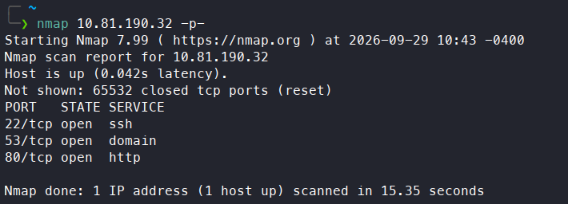
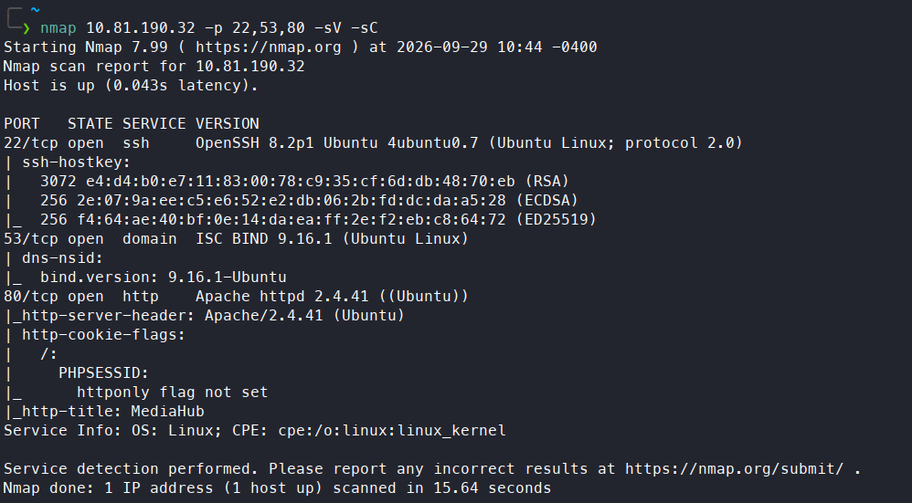

# Interceptor

**Difficulty:** 🟡 Medium · **Room:** [TryHackMe ↗](https://tryhackme.com/room/interceptor)

**MediaHub** appears to be a normal internal portal used by journalists to manage content. Everything seems protected behind a login and verification system, but the real story lies in how the application communicates with its backend APIs.

Your task is to assume the role of an attacker and closely observe traffic between the browser and the server. Using your proxy skills, intercept the requests, analyse how the application processes them, and experiment with modifying the data being sent.

If you understand the flow well enough, a small change in the request might be all it takes to bypass the intended controls. Fire up your proxy, intercept the traffic, and see if you can manipulate the requests to take control of the system.

---

## Reconnaissance 

To map out the attack surface I run `nmap` scan first:

So `ssh` is running on port `22`, `http` on `80` and probably `DNS` on `53`. I follow with a more detailed scan:

Here everything look normal except `PHPSESSID` doesn't have `HttpOnly` flag set.