# TryHackMe - Recruit

[](https://tryhackme.com/room/recruitwebchallenge)


---

## Table of Contents

1. [Overview](#overview)
2. [Attack Path Overview](#attack-path-overview)
3. [Enumeration](#enumeration)
4. [Initial Access](#initial-access)
5. [SQL Injection](#sql-injection)
6. [Vulnerabilities Exploited](#vulnerabilities-exploited)
7. [Tools Used](#tools-used)
8. [Lessons Learned](#lessons-learned)
9. [References](#references)
10. [Disclaimer](#disclaimer)

---

## Overview

This write-up documents my methodology for completing the **Recruit** room on TryHackMe, a medium-difficulty web application challenge modeled on a recruitment portal.

The objective was to capture both the **User** and **Admin** flags. This was achieved by enumerating the application, exploiting a **Local File Inclusion (LFI)** vulnerability to disclose application source code and credentials, and subsequently leveraging **UNION-based SQL Injection** to extract administrator credentials from the backend database.

---

## Attack Path Overview

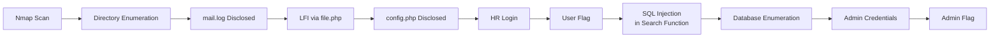

| Stage | Technique | Outcome |
|---|---|---|
| 1 | Port and service enumeration | Identified SSH, DNS, HTTP |
| 2 | Directory brute-forcing | Discovered exposed `mail.log` |
| 3 | Local File Inclusion (`file.php`) | Disclosed `config.php` credentials |
| 4 | Authentication as `hr` | Retrieved User flag |
| 5 | UNION-based SQL injection | Enumerated database, extracted admin credentials |
| 6 | Authentication as administrator | Retrieved Admin flag |

---

## Enumeration

### Port and Service Scanning

A TCP connect scan with default script enumeration was run first to establish the attack surface:

```bash
nmap -sT -sC TARGET-IP
```

**Results:**

| Port | Service |
|:--:|---|
| 22 | SSH |
| 53 | DNS |
| 80 | HTTP |

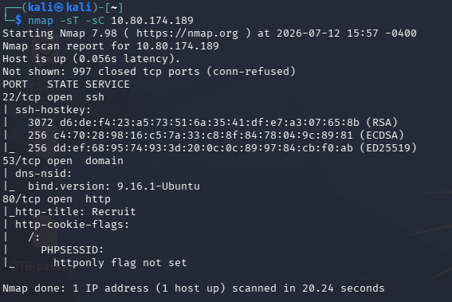

With HTTP identified as the primary attack surface, subsequent enumeration focused on the web application.

### Directory Enumeration

Directory brute-forcing was performed against the web root to surface content not linked from the main application:

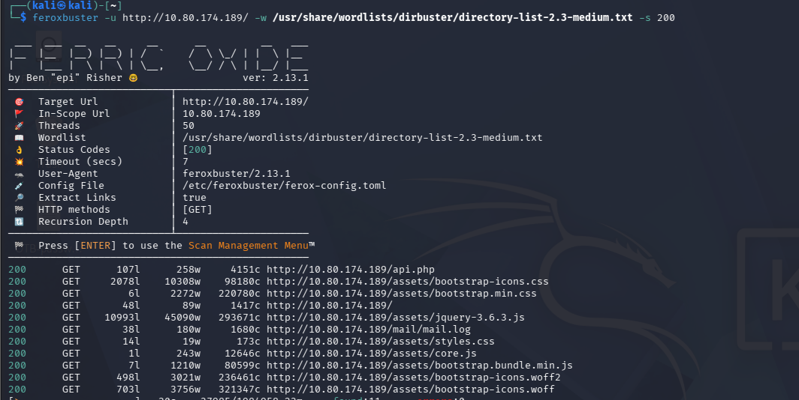

This uncovered an exposed application log:

```
http://TARGET-IP/mail/mail.log
```

The log disclosed two useful pieces of information: a valid application username, **hr**, and a reference indicating that credentials were stored in `config.php` — a strong hint that a file disclosure vulnerability would be the next step.

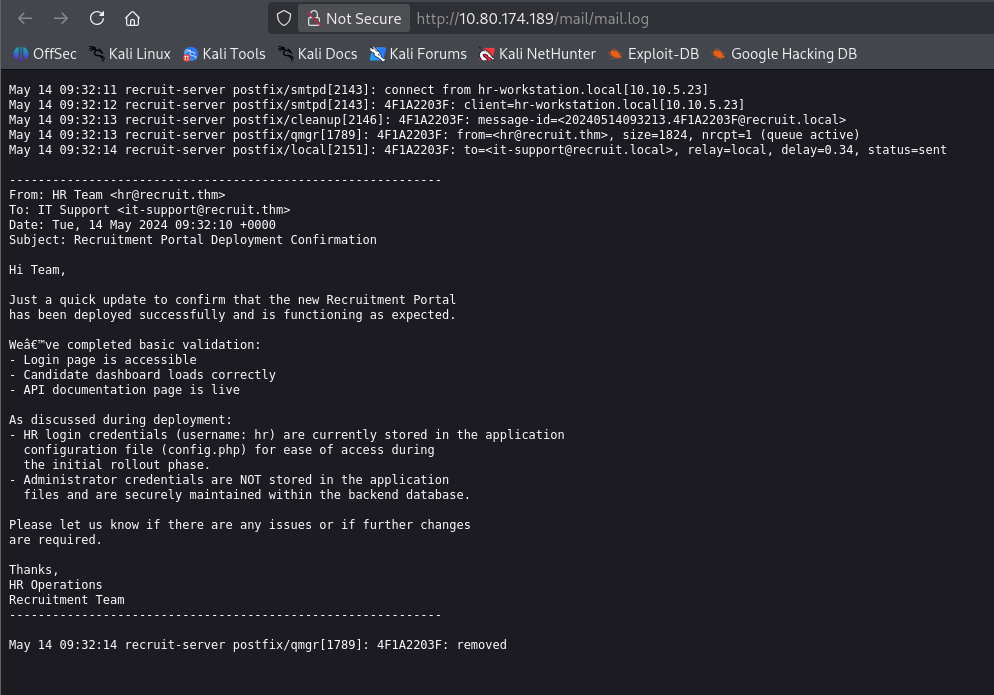

---

## Initial Access

### Identifying the LFI Vector

Further exploration of the application surfaced an API endpoint:

```
http://TARGET-IP/api.php
```

This endpoint indicated that a candidate's CV was retrieved through a separate file-fetching endpoint:

```
/file.php?cv=<URL>
```

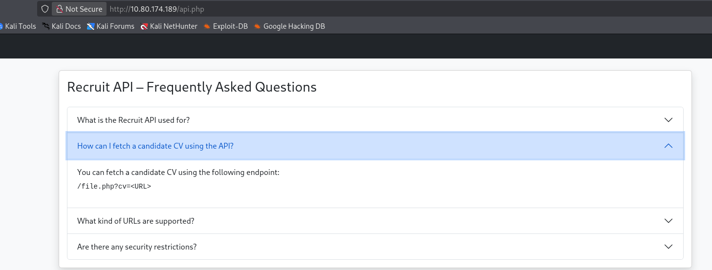

Passing local paths and stream wrappers into the `cv` parameter confirmed a **Local File Inclusion (LFI)** vulnerability, as the endpoint failed to restrict retrieval to remote or expected file locations.

### Exploiting the LFI

Using the `file://` wrapper, the previously referenced configuration file was requested directly:

```
http://TARGET-IP/file.php?cv=file:////var/www/html/config.php
```

The response disclosed valid application credentials in plaintext.

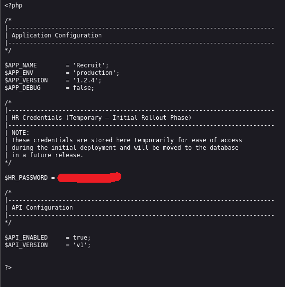

These credentials were used to authenticate as **hr**, yielding the **User flag**.

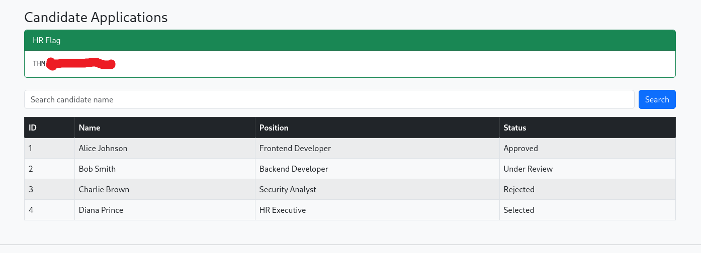

---

## SQL Injection

With authenticated access as `hr`, attention turned to the application's internal search functionality, which appeared to query the backend database directly.

Testing the search parameter with standard SQL injection payloads confirmed that it was vulnerable to **UNION-based SQL Injection**.

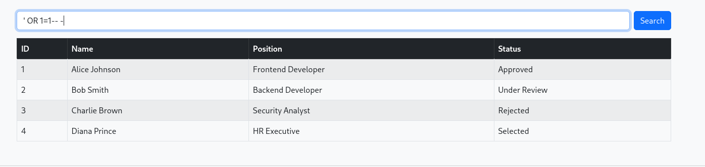

### Column Enumeration

Before extracting data, the number of columns returned by the underlying query had to be determined so that a matching `UNION SELECT` could be crafted:

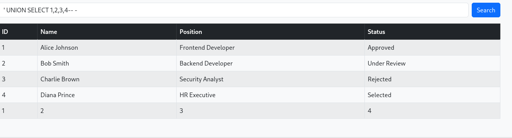

### Database and Table Enumeration

With a working `UNION SELECT`, the injection point was used to enumerate the database schema, starting with the available tables:

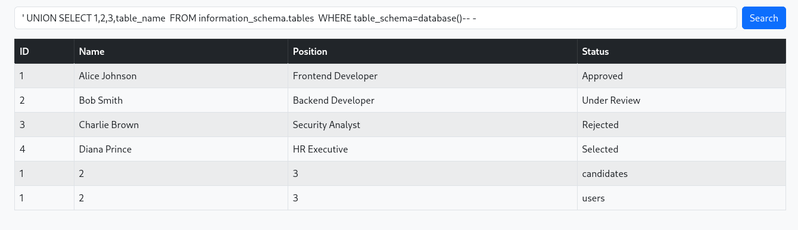

The `users` table stood out as the likely source of authentication data. Its columns were enumerated next:

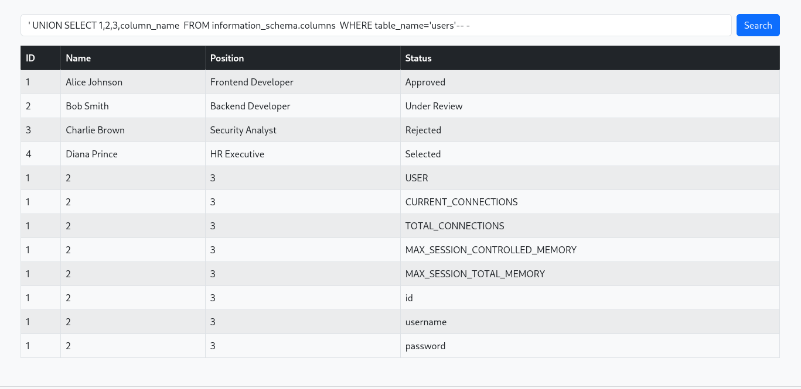

### Extracting Administrator Credentials

With the relevant table and column names identified, the injection was used to extract stored administrator credentials directly from the `users` table:

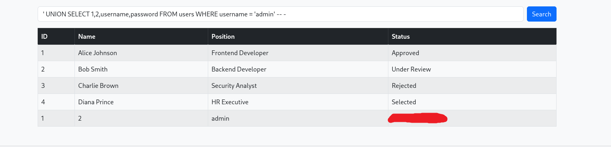

Authenticating with the recovered credentials granted administrator access and the **Admin flag**, completing the room.

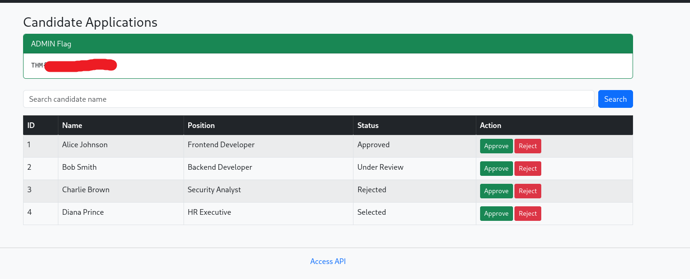

---

## Vulnerabilities Exploited

| Vulnerability | Impact |
|---|---|
| Local File Inclusion (LFI) | Allowed arbitrary file disclosure, including application source and credentials |
| UNION-based SQL Injection | Enabled full database schema enumeration and credential extraction |
| Plaintext credentials in `config.php` | Provided valid application credentials once file disclosure was achieved |

---

## Tools Used

| Tool | Purpose |
|---|---|
| Nmap | Port and service enumeration |
| Directory brute-forcer | Discovery of hidden files and endpoints |
| Browser / Burp Suite | Manual request crafting and LFI/SQLi testing |
| Manual UNION-based SQL Injection | Database enumeration and credential extraction |

---

## Lessons Learned

- Thorough enumeration — including logs and other auxiliary files — can surface information (usernames, file paths) that becomes critical later in the attack chain.
- Endpoints that fetch files based on user-supplied input must strictly validate and whitelist sources; unrestricted wrappers like `file://` turn a "remote fetch" feature into a file disclosure vulnerability.
- Sensitive configuration files, including database credentials, should never be reachable through application logic that accepts user-controlled paths.
- UNION-based SQL Injection remains an effective and reliable technique for enumerating database structure and exfiltrating data when input is not parameterized.
- Individually moderate findings (an info leak, a file inclusion bug, an injection point) can be chained together into full compromise — each step should be evaluated for how it enables the next.

---

## References

- [TryHackMe — Recruit](https://tryhackme.com/room/recruitwebchallenge)
- [OWASP — SQL Injection](https://owasp.org/www-community/attacks/SQL_Injection)
- [OWASP — Path Traversal](https://owasp.org/www-community/attacks/Path_Traversal)
- [OWASP Top 10](https://owasp.org/www-project-top-ten/)

---

## Disclaimer

This write-up documents my personal approach to completing the **Recruit** room on TryHackMe. All testing was performed exclusively within the authorized TryHackMe lab environment for educational and skill-development purposes.