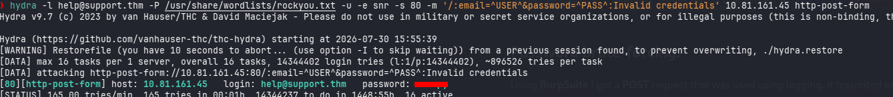
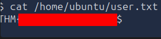

# Support

**Difficulty:** 🟡 Medium · **Room:** [TryHackMe ↗](https://tryhackme.com/room/support)

A new internal **Support Operations Platform** has been deployed to assist IT and helpdesk teams. The application handles user management, internal APIs, and system-level operations. However, security was not the primary focus during development. Several features rely on user-controlled input and weak trust boundaries.

*Can you pentest the platform and escalate your access to achieve RCE on the server?*

---

## Reconnaissance

I ran a full TCP port scan to see the available attack surface:

```bash
sudo nmap TARGET-IP -p-
```

Two ports were open:

| Port | Service | Notes |
|---:|---|---|
| 22 | SSH | Remote administration |
| 80 | HTTP | Web application |

Then I ran a follow-up scan with version detection and default scripts against both:

```bash
sudo nmap TARGET-IP -p 22,80 -sC -sV
```

**Results:**

| Port | Service | Version |
|---:|---|---|
| 22 | SSH | OpenSSH 9.6p1 |
| 80 | HTTP | Apache 2.4.58 |

The web service turned out to be a **Support Operations Panel**. Nmap's script output also flagged that the `PHPSESSID` cookie was missing the `HttpOnly` flag — a small thing on its own, but a hint that cookie handling here was worth a closer look later.


---

## Enumeration

Browsing to port 80 showed a login page for the **Support Operations Panel**. Its footer had a support contact notice:

```
Problems signing in? Contact IT Operations @ help@support.thm
```

That gave me a valid application email, `help@support.thm`, which I'd use later for brute-forcing.


I ran **Feroxbuster** and **Gobuster** in parallel against the web root, which surfaced a few endpoints worth checking out:

```
/dashboard.php
/info.php
/config.php
/skins/
```


---

## Initial Access

I intercepted the login request with **Burp Suite** to see how it was structured, and confirmed credentials were sent via `email` and `password` POST parameters.


Using the email address found earlier, `help@support.thm`, I ran a password brute-force with **Hydra** and got a hit.



I used those credentials to log in.

---

## Cookie Manipulation

After logging in, the app set two cookies:

```
PHPSESSID
isITUser
```

The value of `isITUser` turned out to be the MD5 hash of the string `false`, which suggested IT-level access was being decided client-side instead of on the server.

To test that, I swapped the cookie value for the MD5 hash of `true` instead. That gave me access to functionality meant for IT administrators, confirming the app really was trusting a client-controlled cookie for authorization instead of checking privileges server-side.


---

## API Enumeration

The IT admin panel I'd just unlocked exposed an endpoint for looking up user info:

```
/user/<id>
```

Enumerating a range of IDs turned up more accounts, including one with elevated privileges:

| Email | 2FA | Admin |
|---|---|---|
| IT@support.thm | false | false |
| specialadmin@support.thm | false | true |

`specialadmin@support.thm` was flagged as an admin, so that became my next target.


---

## Local File Inclusion

The dashboard let users pick a visual theme through the `skin` parameter:

```
/dashboard.php?skin=red
```

Themes were stored as individual PHP files inside a `/skins` directory.


I tried a few path traversal sequences against the parameter, like:

```
../dashboard
../config
```

This confirmed a **Local File Inclusion (LFI)** vulnerability — the app's own source code came back in the response and was visible in the raw page source (via browser DevTools), rather than being executed as PHP.

Using the LFI to read `config.php` exposed a hardcoded master password:

```php
$MASTER_PASSWORD = 'REDACTED';
```

The disclosed source also showed exactly how the `skin` parameter was handled server-side, which explained why the traversal worked in the first place — it was concatenated straight into a file path with no sanitization. That turned a simple source-disclosure bug into direct credential exposure.

---

## Administrative Access

With the master password in hand and `specialadmin@support.thm` already identified, I tried logging in directly.

The password as disclosed didn't work on its own — removing the `@` character from it did the trick. That suggested the value stored in `config.php` was a lightly obfuscated or slightly modified version of the real password, not a literal copy.

Logging in with the corrected password gave me full admin access and the flag.


---

## Remote Code Execution

The admin interface had a feature for showing the current server date and time. Intercepting that request in **Burp Suite** revealed a `sys` parameter holding an encoded `date` command.


The app seemed to restrict this parameter to date-related input, but testing standard shell separators showed I could append extra commands alongside the intended one:

```bash
date +"%H:%M:%S"; whoami
```

The injected `whoami` ran successfully, confirming an **OS command injection** in how the `sys` parameter was handled.


With arbitrary command execution confirmed, I used it to get a reverse shell: prepared a payload, hosted it on my attacking machine, started a listener, then used the injection point to fetch and run the payload on the target.


That gave me an interactive shell, and with it, the user flag.



---

## Kill Chain

This box was really about one weak trust boundary after another. A brute-forceable login got me in the door, but the real damage came from an authorization cookie that could just be edited client-side, handing over admin-only functionality for free. That access exposed more accounts, and a separate LFI bug in the theme selector leaked the application's source and a hardcoded (if slightly obfuscated) admin password. From there, a command injection in a "harmless" date-display feature was enough to get a full shell on the box.

`Brute-forced login → cookie-based privilege escalation → LFI credential disclosure → command injection → RCE`

- **Initial Access:** Disclosed support email → Hydra brute-force → valid low-privilege login
- **Privilege Escalation:** Client-side `isITUser` cookie → IT admin panel access
- **Credential Disclosure:** LFI via the `skin` parameter → hardcoded master password in `config.php`
- **Administrative Access:** Slightly modified disclosed password → full admin login as `specialadmin`
- **Remote Code Execution:** Command injection in the `sys` parameter → reverse shell, user flag

None of these issues were especially advanced on their own — a weak password, a client-side auth check, an unsanitized file path, an incomplete input filter — but chained together they took an anonymous visitor all the way to code execution.

> Thanks for reading!