# TryHackMe - Support

[](https://tryhackme.com/room/support)


---

## Table of Contents

1. [Overview](#overview)
2. [Attack Path Overview](#attack-path-overview)
3. [Reconnaissance](#reconnaissance)
4. [Enumeration](#enumeration)
5. [Initial Access](#initial-access)
6. [Cookie Manipulation](#cookie-manipulation)
7. [API Enumeration](#api-enumeration)
8. [Local File Inclusion](#local-file-inclusion)
9. [Administrative Access](#administrative-access)
10. [Remote Code Execution](#remote-code-execution)
11. [Flags](#flags)
12. [Findings Summary](#findings-summary)
13. [Tools Used](#tools-used)
14. [Lessons Learned](#lessons-learned)
15. [References](#references)
16. [Disclaimer](#disclaimer)

---

## Overview

This write-up documents my methodology for completing the **Support** room on TryHackMe, a medium-difficulty web application challenge built around an IT support ticketing portal.

The attack chain progressed through several distinct stages:

- Service and web enumeration
- Credential brute-forcing against a disclosed email address
- Exploitation of a client-controlled authorization cookie
- API enumeration to identify additional accounts
- Local File Inclusion (LFI) leading to source code and credential disclosure
- Administrative authentication using a recovered, lightly-obfuscated password
- OS command injection resulting in remote code execution

Each stage built directly on information or access gained in the previous one, making this a good example of a realistic vulnerability chain rather than a single isolated bug.

---

## Attack Path Overview

```mermaid
flowchart LR
    A[Nmap Scan] --> B[Web Enumeration]
    B --> C[Credential Brute Force]
    C --> D[Support Dashboard Access]
    D --> E[Cookie Manipulation]
    E --> F[IT Admin Panel]
    F --> G[API Enumeration]
    G --> H[LFI via skin Parameter]
    H --> I[config.php Disclosure]
    I --> J[Admin Credentials]
    J --> K[Admin Panel Access]
    K --> L[Command Injection]
    L --> M[Remote Code Execution]
```

| Stage | Technique | Outcome |
|---|---|---|
| 1 | Nmap service scan | Identified web app, weak cookie configuration |
| 2 | Web/directory enumeration | Disclosed support email, key endpoints |
| 3 | Credential brute-forcing (Hydra) | Valid low-privilege credentials |
| 4 | Cookie manipulation (`isITUser`) | Escalated to IT admin functionality |
| 5 | API enumeration | Identified administrator account |
| 6 | LFI via `skin` parameter | Disclosed source code and `config.php` |
| 7 | Credential reuse (modified) | Administrative access |
| 8 | OS command injection | Remote code execution, user flag |

---

## Reconnaissance

### Port Scanning

A full TCP port scan was run to establish the available attack surface:

```bash
sudo nmap TARGET-IP -p-
```

Two open ports were identified:

| Port | Service | Notes |
|---:|---|---|
| 22 | SSH | Remote administration |
| 80 | HTTP | Web application |

A follow-up scan with version detection and default scripts was run against both ports:

```bash
sudo nmap TARGET-IP -p 22,80 -sC -sV
```

**Results:**

| Port | Service | Version |
|---:|---|---|
| 22 | SSH | OpenSSH 9.6p1 |
| 80 | HTTP | Apache 2.4.58 |

The web service was identified as a **Support Operations Panel**. Notably, Nmap's script output also flagged that the `PHPSESSID` cookie was missing the `HttpOnly` flag — a minor finding on its own, but an early signal that cookie handling in this application was worth scrutinizing further.

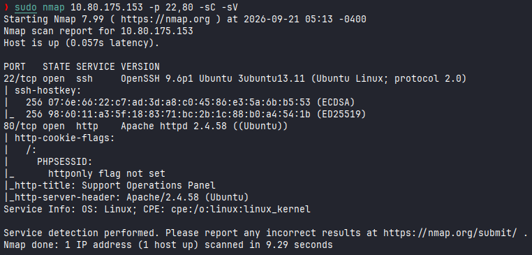

---

## Enumeration

### Web Application Review

Browsing to port 80 presented a login page for the **Support Operations Panel**. The page footer included a support contact notice:

```
Problems signing in? Contact IT Operations @ help@support.thm
```

This disclosed a valid application email address, `help@support.thm`, which would later serve as the target for credential brute-forcing.


### Directory Enumeration

**Feroxbuster** and **Gobuster** were used in parallel to enumerate directories and files on the web root.

This surfaced several endpoints of interest:

```
/dashboard.php
/info.php
/config.php
/skins/
```

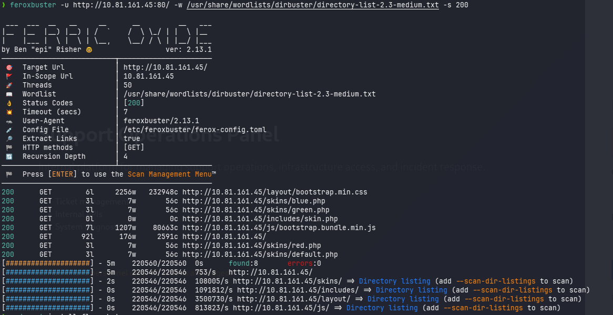
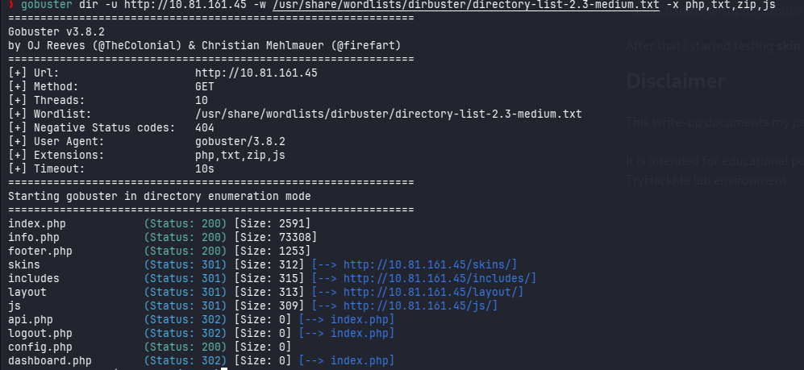

---

## Initial Access

### Credential Brute Force

The login request was intercepted with **Burp Suite** to understand its structure, confirming that credentials were submitted via `email` and `password` POST parameters.

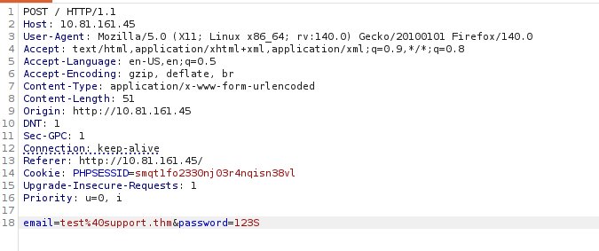

Using the email address discovered earlier, `help@support.thm`, a password brute-force attack was run with **Hydra** and successfully identified a valid password.

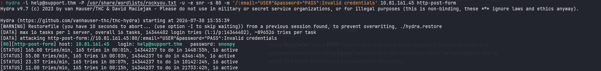

These credentials were used to authenticate to the application.

---

## Cookie Manipulation

Upon successful authentication, the application issued two cookies of interest:

```
PHPSESSID
isITUser
```

The value of `isITUser` was identified as the MD5 hash of the string `false`, suggesting that IT-level authorization was determined client-side rather than being enforced server-side.

To test this, the cookie value was replaced with the MD5 hash of `true`. This granted access to functionality intended for IT administrators, confirming that the application relied on a client-controlled cookie for authorization decisions rather than validating privilege server-side.

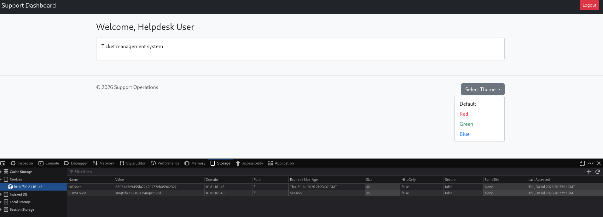
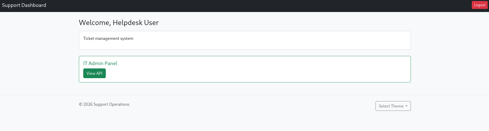

---

## API Enumeration

The now-accessible IT administration panel exposed an endpoint for retrieving user information:

```
/user/<id>
```

Enumerating this endpoint across a range of IDs revealed additional accounts, including one with elevated privileges:

| Email | 2FA | Admin |
|---|---|---|
| IT@support.thm | false | false |
| specialadmin@support.thm | false | true |

The `specialadmin@support.thm` account was flagged as an administrator and became the next target.

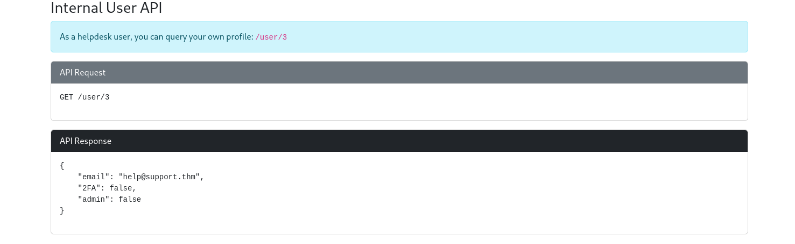

---

## Local File Inclusion

### Vulnerability Discovery

The dashboard allowed users to select a visual theme via the `skin` parameter:

```
/dashboard.php?skin=red
```

Available themes were stored as individual PHP files inside a `/skins` directory.

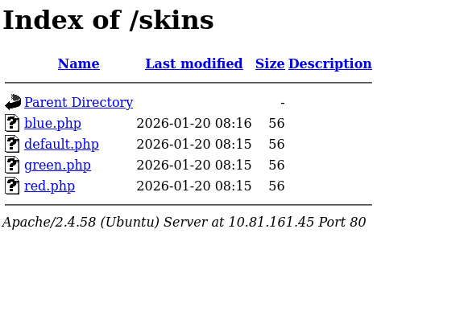

Testing path traversal sequences against the parameter — for example:

```
../dashboard
../config
```

confirmed a **Local File Inclusion (LFI)** vulnerability: the application's own source code was returned in the response and was visible upon inspecting the raw page source (via browser DevTools), rather than being rendered as executed PHP.

### Configuration Disclosure

Leveraging the LFI to read `config.php` exposed a hardcoded master password:

```php
$MASTER_PASSWORD = 'support@110';
```

The disclosed source also clarified exactly how the `skin` parameter was handled server-side, which confirmed why the traversal payloads worked — the parameter was concatenated directly into a file path without sanitization. This turned the LFI from a source-disclosure bug into a direct path to sensitive credential exposure.

---

## Administrative Access

With the master password disclosed and the administrator account (`specialadmin@support.thm`) already identified via API enumeration, authentication was attempted directly.

The raw disclosed password did not work as-is; removing the `@` character from `support@110` produced a working credential. This suggested the value in `config.php` had been lightly obfuscated or was a variant of the true password rather than a literal copy.

Authenticating with the corrected password granted full administrative access and the associated flag.

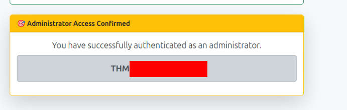

---

## Remote Code Execution

### Identifying the Command Injection

The administrator interface included a feature for displaying the current server date and time. Intercepting this request in **Burp Suite** revealed a `sys` parameter containing an encoded `date` command.

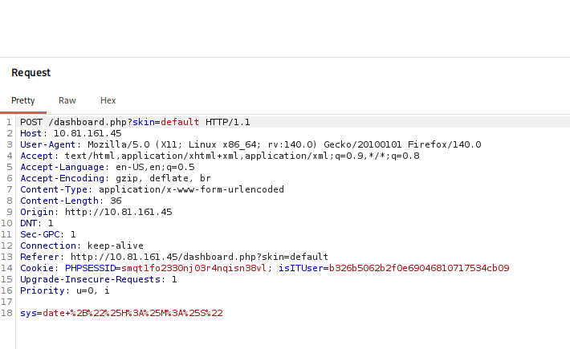

The application appeared to restrict this parameter to expected `date`-related input. However, testing standard shell command separators showed that additional commands could be appended and executed alongside the intended one:

```bash
sys=date+%22%H:%M:%S%22;%20whoami #date+"%H:%M:%S"; whoami
```

The injected `whoami` command executed successfully, confirming an **OS command injection** vulnerability in how the `sys` parameter was processed.

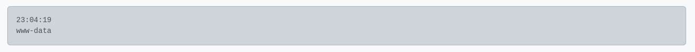

### Obtaining a Reverse Shell

With arbitrary command execution confirmed, the vulnerability was used to establish an interactive reverse shell within the authorized lab environment:

1. Prepared a reverse shell payload.
2. Hosted the encoded payload on the attacking machine.
3. Started a listener to catch the callback.
4. Used the command injection point to fetch and execute the payload on the target.
5. Received an interactive shell connection.

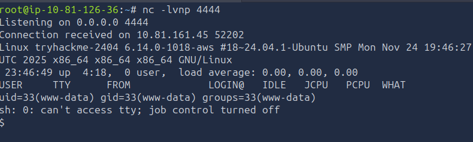

---

## Flags

### User Flag

The user flag was retrieved once command execution on the target was confirmed.


---

## Findings Summary

| Finding | Severity | Impact |
|---|---|---|
| Credential brute force feasible | Medium | Unauthorized low-privilege account access |
| Client-side authorization (`isITUser` cookie) | High | Unauthorized escalation to IT admin functionality |
| API user enumeration | Medium | Disclosure of account emails and privilege levels |
| Local File Inclusion via `skin` parameter | High | Source code and configuration disclosure |
| Hardcoded/obfuscated credentials in `config.php` | High | Administrative account compromise |
| OS command injection in `sys` parameter | Critical | Arbitrary command execution / full compromise |

---

## Tools Used

| Tool | Purpose |
|---|---|
| Nmap | Port and service enumeration |
| Feroxbuster | Directory and file enumeration |
| Gobuster | Supplementary directory/file enumeration |
| Burp Suite | HTTP interception and request manipulation |
| Hydra | Credential brute-forcing |
| Netcat | Reverse shell listener |
| Firefox | Manual web application testing |

---

## Lessons Learned

- Authorization must be enforced server-side; client-controlled values such as cookies or hidden fields should never be trusted to gate privileged functionality.
- Directory and API enumeration frequently reveal additional attack surface — endpoints, accounts, or parameters — that aren't linked from the visible UI.
- LFI vulnerabilities are rarely "just" file disclosure; they routinely expose source code and configuration files containing hardcoded secrets.
- Credentials recovered through information disclosure may be slightly modified or obfuscated — it's worth testing close variants before assuming a lead is a dead end.
- Parameters that appear to be restricted to a specific command (like a fixed `date` call) still need testing with shell metacharacters, as backend validation is often incomplete.
- This room is a strong example of vulnerability chaining: no single finding was catastrophic in isolation, but each one enabled the next step toward full compromise.

---

## References

- [TryHackMe — Support](https://tryhackme.com/room/support)
- [OWASP — Path Traversal](https://owasp.org/www-community/attacks/Path_Traversal)
- [OWASP — Command Injection](https://owasp.org/www-community/attacks/Command_Injection)
- [OWASP — Authentication Cheat Sheet](https://cheatsheetseries.owasp.org/cheatsheets/Authentication_Cheat_Sheet.html)
- [OWASP — Authorization Cheat Sheet](https://cheatsheetseries.owasp.org/cheatsheets/Authorization_Cheat_Sheet.html)

---

## Disclaimer

This write-up documents my personal approach to completing the **Support** room on TryHackMe. It is intended for educational purposes only. All testing was performed exclusively within the authorized TryHackMe lab environment.